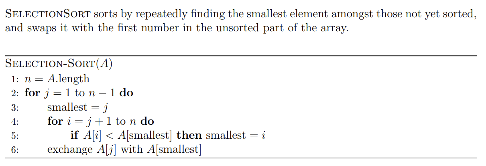
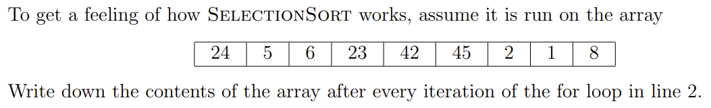
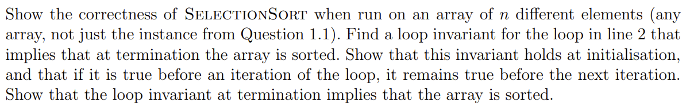
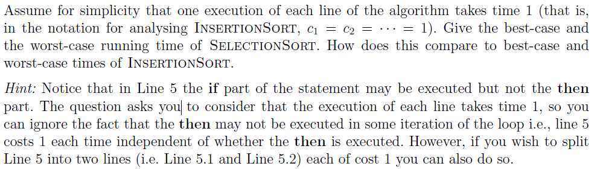

# Assignment I - DSAA(H)

**Name**: Yuxuan HOU (侯宇轩)

**Student ID**: 12413104

**Date**: 2025.09.15



## Question 1.1 (0.25 marks)



Sol:

- 1, 5, 6, 23, 42, 45, 2, 24, 8
- 1, 2, 6, 23, 42, 45, 5, 24, 8
- 1, 2, 5, 23, 42, 45, 6, 24, 8
- 1, 2, 5, 6, 42, 45, 23, 24, 8
- 1, 2, 5, 6, 8, 45, 23, 24, 42
- 1, 2, 5, 6, 8, 23, 45, 24, 42
- 1, 2, 5, 6, 8, 23, 24, 45, 42
- 1, 2, 5, 6, 8, 23, 24, 42, 45

## Question 1.2 (0.5 marks)



PF: 

**Loop invariant**: At the start of each iteration of the for loop of lines 2-6, the subarray $A[1, j - 1]$ consists of the $j - 1$ smallest elements of the whole array but in sorted order.

**Initialization**: For $j = 1$ the original subarray is empty and trivially sorted.

**Maintenance**: During the iteration $j$, the minimum element in $A[j, n]$ will be swapped to $A[j]$ by the inner for loop of line 4-5 and line 6, and the element will be the largest element of $A[1, j]$, which keeps $A[1, j]$ contains the $j$ smallest elements of the whole array and in sorted order, for every element in $A[j, n]$ is larger than it in $A[1, j - 1]$ initially.

**Termination**: The for loop of lines 2-6 ends when $j = n - 1$, at which $A[1, n - 1]$ contains the $n - 1$ smallest elements of the whole array in sorted order and smaller than $A[n]$ due to the loop invariant. Therefore, $A[1, n]$ is in sorted order.

$\texttt{Q.E.D.}$

## Question 1.3 (0.5 marks) (-0.01)



Sol:

Assuming $s_j$ represents the times of inner loop of lines 4-5 for the j-th loop of lines 2-6.

Times for each line:

1. $1$.
2. $n - 1$.
3. $n - 1$.
4. $s_j = n - j$ for each $j$, which is, $\sum_{j = 1}^{n - 1}(n - j) = \dfrac{n(n - 1)}{2}$.
5. same as line 4, which is, $\dfrac{n(n - 1)}{2}$.
6. $n - 1$.

For we have $c_i = 1$, then total:
$$
T(n) = 1 + (n - 1) \times 3 + \dfrac{n(n - 1)}{2} \times 2 = (n + 3)(n - 1) + 1
$$
which is $\Theta(n^2)$.

Note that the $s_j$ is not relevant to the actual array $A[1, n]$, thus the best-case and the worst-case are all **quadratic**, unlike InsertionSort which is linear and quadratic.

> Plus, if we split line 5 into two lines, the times of assign line will become relevant to the original array $A[1, n]$, but the runtime is still quadratic.

**Revisal:** question1.3: the cost times of line 4 is $\sum_{j=1}^{n-1}(n-j+1)$. (-0.01)

## Programming Question 1.4 (0.25 marks)


P.S.: Main code only.

```cpp
int main(){
    basic_string < int > res;
    int N = read() - 1;
    res += read();
    for(int i = 1; i <= N; ++i){
        int val = read();
        for(auto it = res.begin(); it != res.end(); advance(it, 1)){
            if(*it > val){res.insert(it, val); break;}
            if(it == prev(res.end())){res += val; break;}
        }
    }
    for(auto i : res)printf("%d ", i);
    printf("\n");

    // fprintf(stderr, "Time: %.6lf\n", (double)clock() / CLOCKS_PER_SEC);
    return 0;
}
```

```cpp
int main(){
    basic_string < int > res;
    int N = read();
    for(int i = 1; i <= N; ++i)res += read();
    for(auto it = res.begin(); it != prev(res.end()); advance(it, 1))
        swap(*it, *min_element(it, res.end()));
    for(auto i : res)printf("%d ", i);
    printf("\n");

    // fprintf(stderr, "Time: %.6lf\n", (double)clock() / CLOCKS_PER_SEC);
    return 0;
}
```

```cpp
int main(){
    vector < pair < int, int > > res;
    int N = read(), M = read();
    M = M + (M >> 1);
    for(int i = 1; i <= N; ++i){
        int a = read(), b = read();
        res.push_back({a, b});
    }
    for(auto it = res.begin(); it != prev(res.end()); advance(it, 1))
        swap(*it, *min_element(it, res.end(), [](const pair < int, int > &a, const pair < int, int > &b)->bool{
            return a.second == b.second ? a.first < b.first : a.second > b.second;
        }));
    int cutoff = res.at(M - 1).second;
    while(M < N && res.at(M).second == cutoff)++M;
    printf("%d %d\n", cutoff, M);
    res.resize(M);
    for(auto [a, b] : res)printf("%d %d\n", a, b);

    // fprintf(stderr, "Time: %.6lf\n", (double)clock() / CLOCKS_PER_SEC);
    return 0;
}

```

```cpp
int main(){
    basic_string < int > book;
    int N = read(), Q = read();
    for(int i = 1; i <= N; ++i)book += read();
    for(auto it = book.begin(); it != prev(book.end()); advance(it, 1))
        swap(*it, *min_element(it, book.end()));
    auto cal = [](int N)->int{int ret(1); while(N--)ret *= 10; return ret;};
    while(Q--){
        int len = read(), pat = read();
        for(auto it = book.begin(); it != book.end(); advance(it, 1)){
            if(*it % cal(len) == pat){printf("%d\n", *it); break;}
            if(it == prev(book.end()))printf("-1\n");
        }
    }

    // fprintf(stderr, "Time: %.6lf\n", (double)clock() / CLOCKS_PER_SEC);
    return 0;
}
```

```cpp
int main(){
    vector < tuple < int, int, string > > team;
    int N = read();
    for(int i = 1; i <= N; ++i){
        string S; cin >> S;
        int s = read();
        basic_string < int > vals;
        for(int j = 1; j <= 6; ++j)vals += read();
        team.push_back({i, accumulate(vals.begin(), vals.end(), s * 10) - *max_element(vals.begin(), vals.end()) - *min_element(vals.begin(), vals.end()), S});
    }
    for(auto it = team.begin(); it != prev(team.end()); advance(it, 1))
        swap(*it, *min_element(it, team.end(), [](const tuple < int, int, string > &a, const tuple < int, int, string > &b)->bool{
            return get < 1 >(a) == get < 1 >(b) ? get < 0 >(a) < get < 0 >(b) : get < 1 >(a) > get < 1 >(b);
        }));
    int M = min(N, 3);
    int cutoff = get < 1 >(team.at(M - 1));
    while(M < N && get < 1 >(team.at(M)) == cutoff)++M;

    team.resize(M);
    for(auto [idx, s, S] : team)cout << S << " " << s << endl;

    // fprintf(stderr, "Time: %.6lf\n", (double)clock() / CLOCKS_PER_SEC);
    return 0;
}
```

