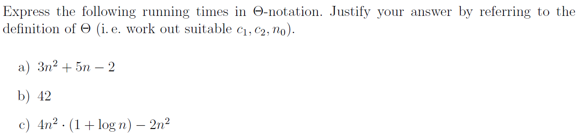
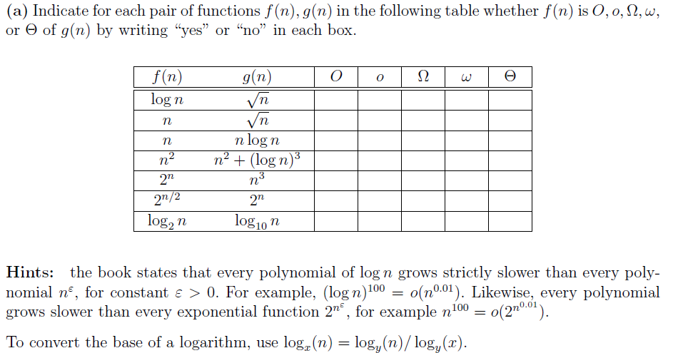
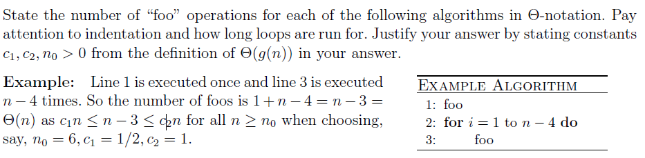
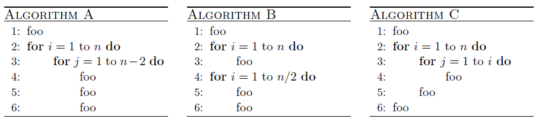
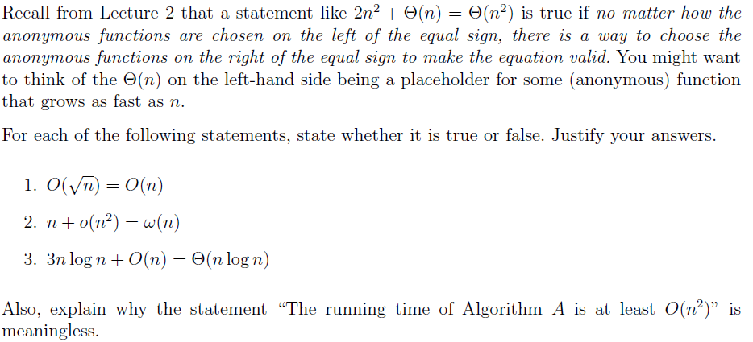
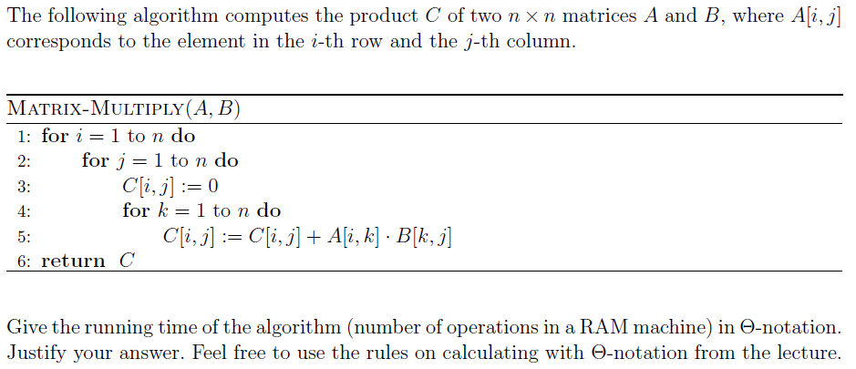
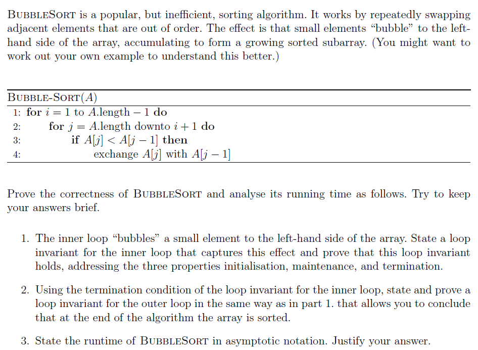
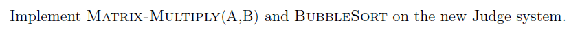

# Assignment II - DSAA(H)

**Name**: Yuxuan HOU (侯宇轩)

**Student ID**: 12413104

**Date**: 2025.09.22

## Question 2.1 (0.3 marks)



Sol:

a. $\Theta(n^2)$.
$$
\begin{aligned}
	& c_1 n^2 \le 3n^2 + 5n - 2 \le c_2n^2 \\
	\iff & c_1 \le -\dfrac{2}{n^2} + \dfrac{5}{n} + 3 \le c_2 \\
\end{aligned}
$$
w.l.o.g., let $c_1 = 3, c_2 = 6, n_0 = 1$, we can prove it by Sandwich Theorem.

$\texttt{Q.E.D.}$

b. $\Theta(1)$.

Simutaneously, let $c_1 = c_2 = 42, n_0 = 1$, it's easy to prove.

$\texttt{Q.E.D.}$

c. $\Theta(n^2\log n)$.
$$
\begin{aligned}
	& c_1 n^2\log n \le 4n^2 \cdot (1 + \log n) - 2n^2 \le c_2n^2 \log n \\
	\iff & c_1 \le \dfrac{2}{\log n} + 4 \le c_2 \\
\end{aligned}
$$
w.l.o.g., let $c_1 = 4, c_2 = 6, n_0 = 2$, we can prove it by Sandwich Theorem.

$\texttt{Q.E.D.}$

## Question 2.2 (0.7 marks)



Sol:

|      |    $f(n)$    |        $g(n)$        | $O$  | $o$  | $\Omega$ | $\omega$ | $\Theta$ |
| :--: | :----------: | :------------------: | :--: | :--: | :------: | :------: | :------: |
|  1   |   $\log n$   |      $\sqrt{n}$      | yes  | yes  |    no    |    no    |    no    |
|  2   |     $n$      |      $\sqrt{n}$      |  no  |  no  |   yes    |   yes    |    no    |
|  3   |     $n$      |      $n\log n$       | yes  | yes  |    no    |    no    |    no    |
|  4   |   $n^{2}$    | $n^{2}+(\log n)^{3}$ | yes  |  no  |   yes    |    no    |   yes    |
|  5   |   $2^{n}$    |       $n^{3}$        |  no  |  no  |   yes    |   yes    |    no    |
|  6   |  $2^{n/2}$   |       $2^{n}$        | yes  | yes  |    no    |    no    |    no    |
|  7   | $\log_{2} n$ |    $\log_{10} n$     | yes  |  no  |   yes    |    no    |   yes    |

## Question 2.3 (0.3 marks)





Sol:

**Algorithm A:**Line 1 is executed once, lines 4-6 is executed $n(n - 2)$ times by the nested loop, thus it's $1 + 3n(n - 2) = \Theta(n^2)$.

w.l.o.g., let $c_1 = 1, c_2 = 2, n_0 = 2$.

**Algorithm B:**Line 1 is executed once, line 3 is executed $n$ times by the loop, lines 5-6 is executed $\dfrac{n}{2}$ times by the loop, thus it's $1 + n + 2 \cdot\dfrac{n}{2} = \Theta(n)$.

w.l.o.g., let $c_1 = 1, c_2 = 3, n_0 = 1$.

**Algorithm C:**Line 1 is executed once, line 4 is executed $\sum_{i = 1}^n i = \dfrac{n(n + 1)}{2}$ times by the nested loop, line 5 is executed $n$ times by the loop, line 6 is executed once, thus it's $1 + \dfrac{n(n + 1)}{2} + n + 1 = \Theta(n^2)$.

w.l.o.g., let $c_1 = \dfrac{1}{2}, c_2 = 10, n_0 = 1$.

## Question 2.4 (0.3 marks)



Sol:

1. **False**. For $O(\sqrt{n})$ is a proper subset of $O(n)$, i.e., they're not the same. Conterexample: $f(n) = n$.
2. **False**. For $o(n^2)$ might be a very small value like $1$, then obviously $n + 1 \neq \omega(n)$.
3. **True**. For $O(n)$ is obviously less than $n \log n$, thus there must be $c_1, c_2$ which is legal when $n_0$ is large enough.

**Ex.** For $O(n^2)$ denotes the upper-bound, which is in contrast to 'at least', i.e., we should claim at least $\Omega(n^2)$.

## Question 2.5 (0.3 marks)



Sol: $\Theta(n^3)$.

For line 1 is executed $n + 1$ times, line 2 is executed $n(n + 1)$ times, line 3 is executed $n^2$ times by the nested loop of lines 1-2, line 4 is executed $n^2(n + 1)$ times, line 5 is executed $n^3$ times by the nested loop of lines 1-4 with 3 operations, line 6 is executed once.

Thus, the total Runtime is $(n + 1) + n(n + 1) + n^2 + n^2(n + 1) + 3n^3 + 1 = \Theta(n^3)$, w.l.o.g., let $c_1 = 1, c_2 = 4, n_0 = 10$.

## Question 2.6 (marks 0.75)



Sol:

1. Inner Loop:

**Loop Invariant**: At the start of each iteration of the for loop of lines 2-4, the minimum element in $A[j, A.length]$ is placed at $A[j]$.

**Initialization**: For $j = A.length$ the minimum element of $A[A.length, A.length]$ is trivally placed at $A[A.length]$.

**Maintenance**: During the iteration $j$, if $A[j - 1] > A[j]$, $A[j]$ will be swaped to $A[j - 1]$, then $A[j - 1]$ will hold the minimum element, otherwise $A[j - 1]$ itself if the minimum element, and other values stay unchanged. Thus it will satisfy the next iteration.

**Termination**: The for loop of lines 2-4 ends when $j = i + 1$, and at this time, $A[j - 1]$, which is $A[i]$, will hold the minimum elements in $A[i, A.length]$.

2. Outer Loop:

**Loop Invariant**: At the start of each iteration of the for loop of lines 1-4, the subarray $A[1, i - 1]$ consists of the $i - 1$ smallest elements of the whole array and in sorted order.

**Initialization**: For $i = 1$ the original subarray is empty and trivially sorted.

**Maintenance**: During the iteration $i$, the minimum element in $A[i, A.length]$ will be placed to $A[i]$ by the inner for loop of lines 2-4, and the element will be the largest element of $A[1, i]$, which keeps $A[1, i]$ contains the $i$ smallest elements of the whole array and in sorted order, for every element in $A[i, A.length]$ is larger than it in $A[1, i - 1]$ initially.

**Termination**: The for loop of lines 1-4 ends when $i = A.length - 1$, at which $A[1, A.length - 1]$ contains the $A.length - 1$ smallest elements of the whole array in sorted order and smaller than $A[A.length]$ due to the loop invariant. Therefore, $A[1, A.length]$ is in sorted order.

3. Runtime: $\Theta(n^2)$.

Let $n = A.length$.

For line 1 is executed $n$ times, line 2 is executed $\sum_{i = 1}^{n - 1} (n - i + 1) = \dfrac{(2 + n)(n - 1)}{2}$ times, i.e., line 3 is $\sum_{i = 1}^{n - 1} (n - i) = \dfrac{n(n - 1)}{2}$, line 4 is obviously less than line 3, which is $O(n^2)$.

Thus, $n + \dfrac{(2 + n)(n - 1)}{2} + \dfrac{n(n - 1)}{2} + O(n^2) = \Theta(n^2)$.

For $n + \dfrac{(2 + n)(n - 1)}{2} + \dfrac{n(n - 1)}{2}$, let $c_1 = \dfrac{1}{2}, c2 = 3, n_0 = 10$, it's obviously proved, then $\Theta(n^2) + O(n^2) = \Theta(n^2)$.

## Programming Question 2.7 (0.1 marks)




P.S.: Main code only.

```cpp
char buf[1<<23],*p1=buf,*p2=buf,obuf[1<<23],*O=obuf;
#define getchar() (p1==p2&&(p2=(p1=buf)+fread(buf,1,1<<21,stdin),p1==p2)?EOF:*p1++)
inline int read() {
	int x=0,f=1;char ch=getchar();
	while(!isdigit(ch)){if(ch=='-') f=-1;ch=getchar();}
	while(isdigit(ch)) x=x*10+(ch^48),ch=getchar();
	return x*f;
}

const ll MOD = (ll)(1e9 + 7);
int main(){
    int N = read(), P = read(), M = read();
    vector < vector < ll > > A(N + 1, vector < ll > (P + 1, 0)), B(P + 1, vector < ll > (M + 1, 0));
    for(int i = 1; i <= N; ++i)for(int j = 1; j <= P; ++j)A[i][j] = read();
    for(int i = 1; i <= P; ++i)for(int j = 1; j <= M; ++j)B[i][j] = read();
    for(int i = 1; i <= N; ++i)
        for(int j = 1; j <= M; ++j){
            ll res(0);
            for(int k = 1; k <= P; ++k)(res += A[i][k] * B[k][j] % MOD) %= MOD;
            printf("%lld%c", (res + MOD) % MOD, j == M ? '\n' : ' ');
        }
    // fprintf(stderr, "Time: %.6lf\n", (double)clock() / CLOCKS_PER_SEC);

    return 0;
}
```

```cpp
int main(){
    int N = read();
    vector < int > A(N + 10);
    for(int i = 1; i <= N; ++i)A[i] = read();
    int cnt(0);
    for(int i = 1; i <= N; ++i)
        for(int j = i + 1; j <= N; ++j)
            if(A[i] > A[j])++cnt;
    printf("%d\n", cnt);
    // fprintf(stderr, "Time: %.6lf\n", (double)clock() / CLOCKS_PER_SEC);
    return 0;
}
```

