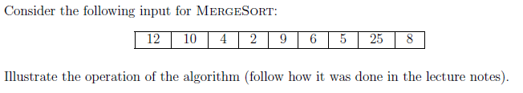
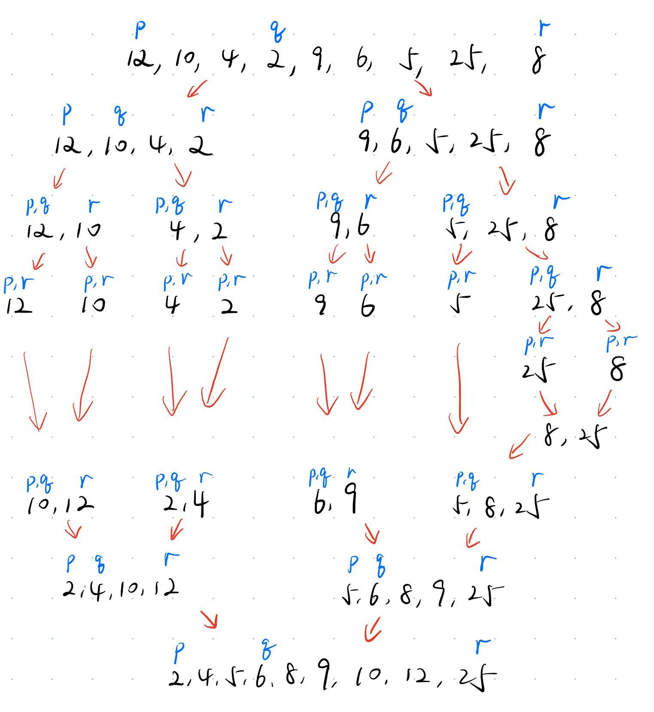
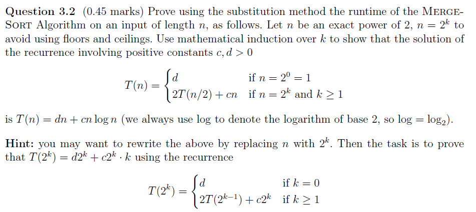
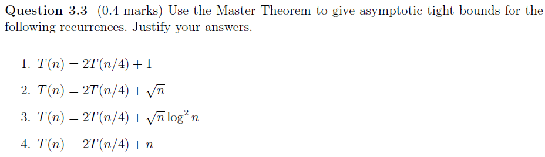
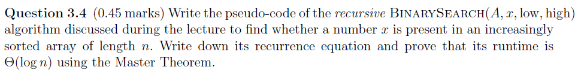
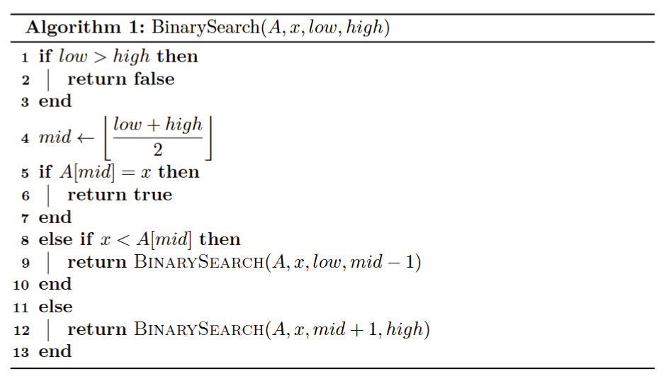
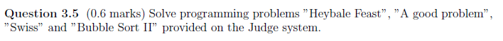

# Assignment III - DSAA(H)

**Name**: Yuxuan HOU (侯宇轩)

**Student ID**: 12413104

**Date**: 2025.10.02

## Question 3.1 (0.1 marks)



Sol: Firstly, divide: `[12, 10, 4, 2 | 9, 6, 5, 25, 8]`, then for the left, keep dividing: `[12, 10 | 4, 2]`, for the right: `[9, 6 | 5, 25, 8]`. And keep dividing: `[12, 10] -> [12 | 10]`, `[4, 2] -> [4 | 2]`, `[9, 6] -> [9 | 6]`, `[5, 25, 8] -> [5 | 25, 8] -> [5], [25 | 8]`. After dividing, implement conquest and combination step by step: `[25], [8] -> [8, 25]`, then,  `[12], [10] -> [10, 12]`, ` [4], [2] -> [2, 4]`, `[9], [6] -> [6, 9]`, `[5], [8, 25] -> [5, 8, 25]`, then, `[10, 12], [2, 4] -> [2, 4, 10, 12]`, `[6, 9], [5, 8, 25] -> [5, 6, 8, 9, 25]`, eventually, `[2, 4, 10, 12], [5, 6, 8, 9, 25] -> [2, 4, 5, 6, 8, 9, 10, 12, 25]` , at which we finished the MergeSort.



## Question 3.2 (0.45 marks)



PF: Base: When $n = 2^0 = 1$, we have $T(n) = d = d \cdot 1 + c \cdot 1 \cdot \log 1$.

For any $k$ s.t. $k \ge 1$, assuming we have $T(2^{k - 1}) = d2^{k - 1} + c2^{k - 1} \cdot (k - 1)$, i.e., the equivalence holds when $n = 2^{k - 1}$.

Then, we have:
$$
\begin{aligned}
T(2^k)
	&= 2T(2^{k - 1}) + c2^k \\
	&= 2(d2^{k - 1} + c2^{k - 1} \cdot (k - 1)) + c2^k \\
	&= d2^k + 2^k \cdot (c(k - 1) + c) \\
	&= d2^k + c2^k \cdot k
\end{aligned}
$$
As we obtain $k = \log n$, thus $T(n) = dn + cn \log n$, i.e., the equivalence holds when $n = 2^k$.

With mathematical induction, we have proved that it holds for all $k \ge 0$.

$\texttt{Q.E.D.}$.

## Question 3.3 (0.4 marks)



Sol:

1. We have $a = 2, b = 4, f(n) = 1$, the watershed: $W(n) = n^{\log_b^a} = n^{\frac{1}{2}}$. Then, let $\epsilon = \frac{1}{2}$, $f(n) = 1 = O(n^{\log_b(\frac{1}{2} - \epsilon)})$, satisfy case 1, thus $T(n) = \Theta(n^{\frac{1}{2}})$.
2. We have $a = 2, b = 4, f(n) = n^\frac{1}{2}$, the watershed: $W(n) = n^{\log_b^a} = n^{\frac{1}{2}}$. Then, let $k = 0$, $f(n) = n^\frac{1}{2} = \Theta(n^{\frac{1}{2}} \cdot \lg^0 n)$, satisfy case 2, thus $T(n) = \Theta(n^{\frac{1}{2}} \log n)$.
3. We have $a = 2, b = 4, f(n) = n^\frac{1}{2} \log^2 n $, the watershed: $W(n) = n^{\log_b^a} = n^{\frac{1}{2}}$. Then, let $k = 2$, $f(n) = n^\frac{1}{2}\log^2 n = \Theta(n^{\frac{1}{2}} \cdot \lg^2 n)$ for the base of log only changes the constants, satisfy case 2, thus $T(n) = \Theta(n^{\frac{1}{2}} \log^3 n)$.
4. We have $a = 2, b = 4, f(n) = n$, the watershed: $W(n) = n^{\log_b^a} = n^{\frac{1}{2}}$. Then, let $\epsilon = \frac{1}{2}$, $f(n) = n = \Omega(n^{\log_b(\frac{1}{2} + \epsilon)})$. And for the regularity, let $c = \frac{1}{2}$, we obtain $af(\dfrac{n}{b}) = 2f(\dfrac{n}{4}) = \dfrac{1}{2}n \le cf(n) = \dfrac{1}{2}n$, satisfy case 3, thus $T(n) = \Theta(n)$.

## Question 3.4 (0.45 marks)

 	

Sol: Pseudo-code:



Recurrence equation:
$$
T(n) = T(\dfrac{n}{2}) + 1
$$
We have $a = 1, b = 2, f(n) = 1$. Watershed: $n^{\log_b^a} = 1$. Let $k = 0$, $f(n) = 1 = \Theta(1 \cdot \lg^0 n)$, satisfy case 2, thus $T(n) = \Theta( \log n)$.

## Question 3.5 (0.6 marks)




```cpp
int N; ll M;

class SegTree{
private:
    int tr[110000 << 2];
    #define LS (p << 1)
    #define RS (LS | 1)
    #define MID ((gl + gr) >> 1)
public:
    void Pushup(int p){
        tr[p] = max(tr[LS], tr[RS]);
    }
    void Build(const vector < int > &A, int p = 1, int gl = 1, int gr = N){
        if(gl == gr)return tr[p] = A[gl = gr], void();
        Build(A, LS, gl, MID), Build(A, RS, MID + 1, gr);
        Pushup(p);
    }
    int Query(int l, int r, int p = 1, int gl = 1, int gr = N){
        if(l <= gl && gr <= r)return tr[p];
        if(gr < l || r < gl)return -1;
        return max(Query(l, r, LS, gl, MID), Query(l, r, RS, MID + 1, gr));
    }
}st;

int main(){
    N = read(); M = read < ll >();
    vector < int > F(N + 10, 0), S(N + 10, 0);
    for(int i = 1; i <= N; ++i)F[i] = read(), S[i] = read();
    st.Build(S);
    vector < ll > sumF(N + 10, 0);
    for(int i = 1; i <= N; ++i)sumF[i] = sumF[i - 1] + F[i];
    auto Check = [](ll sum)->bool{return sum >= M;};
    int res(INT_MAX);
    for(int beg = 1; beg <= N; ++beg){
        int l = beg, r = N, ans = -1;
        while(l <= r){
            int mid = (l + r) >> 1;
            if(Check(sumF[mid] - sumF[beg - 1]))ans = mid, r = mid - 1;
            else l = mid + 1;
        }
        if(ans != -1)res = min(res, st.Query(beg, ans));
    }
    printf("%d\n", res);
    // fprintf(stderr, "Time: %.6lf\n", (double)clock() / CLOCKS_PER_SEC);
    return 0;
}
```

```cpp
int main(){
    int N = read();
    vector < int > A(N + 10, 0);
    for(int i = 1; i <= N; ++i)A[i] = read();

    vector < pair < int, int > > res;

    auto Solve = [&](auto &&self, int l, int r)->void{
        if(l == r)return;
        int mid = (l + r) >> 1;
        for(int i = 1; i <= N; ++i)
            if(mid + 1 <= A[i] && A[i] <= r)res.push_back({2, i});
        int cur(l + 1);
        while(cur < mid + 1)res.push_back({1, cur++});
        self(self, l, mid), self(self, mid + 1, r);
    }; Solve(Solve, 0, N);

    printf("%d\n", res.size());
    for(auto [a, b] : res)printf("%d %d\n", a, b);
    // fprintf(stderr, "Time: %.6lf\n", (double)clock() / CLOCKS_PER_SEC);
    return 0;
}
```

```cpp
int main(){
    int N = read(), R = read(), Q = read();
    N <<= 1;
    vector < tuple < int, int, int > > players;
    for(int i = 1; i <= N; ++i)players.push_back({read(), 0, i});
    for(int i = 1; i <= N; ++i)get < 1 >(players[i - 1]) = read();
    sort(players.begin(), players.end(), [](const tuple < int, int, int > &a, const tuple < int, int, int > &b)->bool{
        return get < 0 >(a) == get < 0 >(b) ? get < 2 >(a) < get < 2 >(b) : get < 0 >(a) > get < 0 >(b);
    });
    while(R--){
        vector < tuple < int, int, int > > winner, loser;
        for(auto it = players.begin(); it < prev(players.end()); advance(it, 2))
            get < 1 >(*it) > get < 1 >(*next(it)) ? (++get < 0 >(*it), winner.push_back(*it), loser.push_back(*next(it))) : (++get < 0 >(*next(it)), winner.push_back(*next(it)), loser.push_back(*it));
        if(players.size() & 1)loser.push_back(*prev(players.end()));

        players.clear();
        for(auto it1 = winner.begin(), it2 = loser.begin(); it1 != winner.end() || it2 != loser.end();){
            if(it1 == winner.end())players.push_back(*it2), ++it2;
            else if(it2 == loser.end())players.push_back(*it1), ++it1;
            else 
                get < 0 >(*it1) == get < 0 >(*it2) ? (get < 2 >(*it1) < get < 2 >(*it2) ? (players.push_back(*it1), ++it1) : (players.push_back(*it2), ++it2)) : get < 0 >(*it1) > get < 0 >(*it2) ? (players.push_back(*it1), ++it1) : (players.push_back(*it2), ++it2);
        }
    }
    // sort(players.begin(), players.end(), [](const tuple < int, int, int > &a, const tuple < int, int, int > &b)->bool{
    //     return get < 0 >(a) == get < 0 >(b) ? get < 2 >(a) < get < 2 >(b) : get < 0 >(a) > get < 0 >(b);
    // });
    printf("%d\n", get < 2 >(players[Q - 1]));


    // fprintf(stderr, "Time: %.6lf\n", (double)clock() / CLOCKS_PER_SEC);
    return 0;
}
```

```cpp
int main(){
    int N = read();
    vector < int > A(N + 10, 0);
    for(int i = 1; i <= N; ++i)A[i] = read();
    ll res(0);
    vector < int > cur;
    for(int i = 1; i <= N; ++i){
        if(cur.empty())cur.push_back(A[i]);
        else{
            auto it = upper_bound(cur.begin(), cur.end(), A[i]);
            res += distance(it, cur.end());
            cur.insert(it, A[i]);
        }
    }printf("%lld\n", res);
    // fprintf(stderr, "Time: %.6lf\n", (double)clock() / CLOCKS_PER_SEC);
    return 0;
}
```

