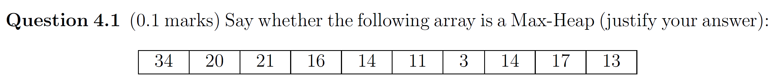
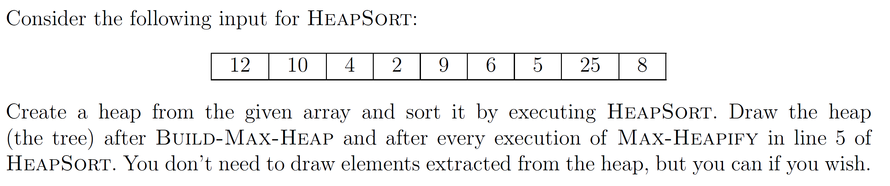
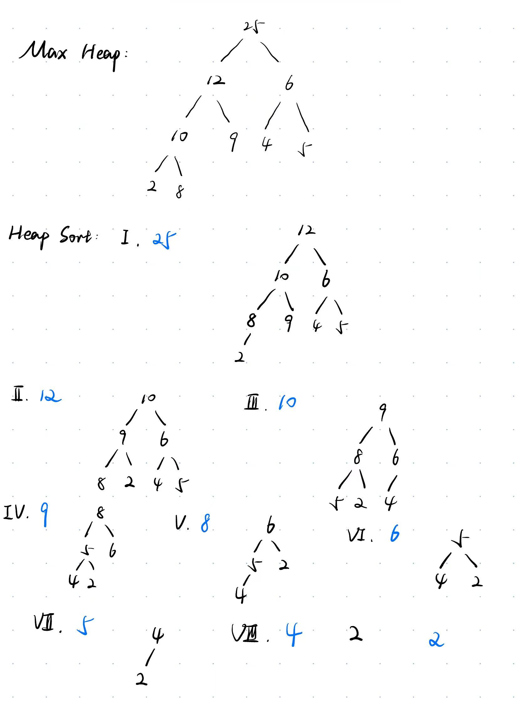
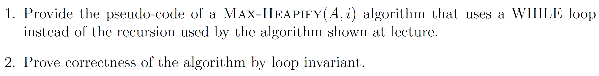
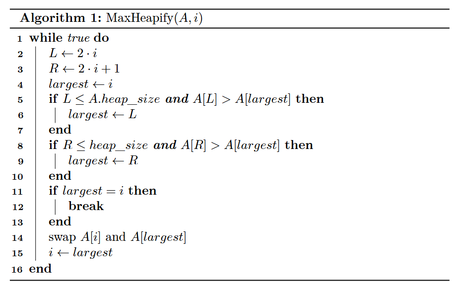
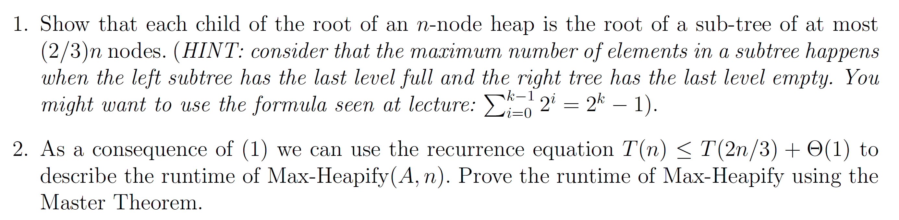
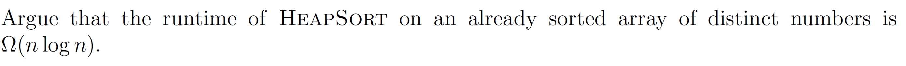
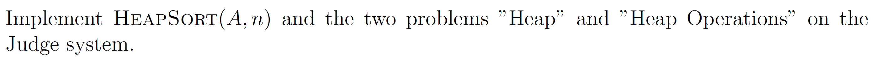

# Assignment IV - DSAA(H)

**Name**: Yuxuan HOU (侯宇轩)

**Student ID**: 12413104

**Date**: 2025.10.11

## Question 4.1 (0.1 marks)



Sol: Check relations:

- $34_1 > 20_2, 21_3$.
- $20_2 > 16_4, 14_5$.

- $21_3 > 11_6, 3_7$.
- $16_4 > 14_8$, but $16_4 \not> 17_9$, which violates the rule.
- $14_5 > 13_{10}$. 

Due to the violation at $4$ to $9$, the array is not a Max-Heap.

## Question 4.2 (0.1 marks)



Sol:



## Question 4.3 (0.5 marks)



Sol:

1. 



2. **Loop invariant**: In each while iteration, the left and right subtrees of i are both Max-Heaps.

   **Initialization**: At the beginning, the condition is trivally satisfy that the left and right subtrees of i are both Max-Heap.

   **Maintenance**: If $largest = i$, then the subtree $i$ will become a Max-Heap, otherwise, the possible violation $i$ will be swaped to $largest$, and $i$ was replaced by $largest$, and for the new $i$, it still follows the loop invariant.

   **Termination**: When $largest = i$, the subtree of final $i$ is a Max-Heap, thus the subtree of initial $i$ will also become a Max-Heap. Plus, the termination is certain.

## Question 4.4 (1.25 marks)

 	

1. PF: Assuming the height is $h$. In the HINT condition, the size of left subtree is:
   $$
   \sum_{i = 0}^{h - 1}2^i = 2^h - 1
   $$
   And for the right subtree, for its last level is empty, the size is:
   $$
   \sum_{i = 0}^{h - 2}2^i = 2^{h - 1} - 1
   $$
   The the total size is:
   $$
   (2^h - 1) + (2^{h - 1} - 1) + 1 = \dfrac{3}{2} \cdot 2^h - 1
   $$
   Thus, we have:
   $$
   \dfrac{2}{3} (\dfrac{3}{2} \cdot 2^h - 1) \ge 2^h - 1
   $$
   Which is to say, the size of the subtree is at most $\dfrac{2}{3}n$ nodes.

   $\texttt{Q.E.D.}$.

2. Sol: We have $a = 1, b = \dfrac{2}{3}, f(n) = \Theta(1)$.

   Watershed: $n^{\log_b^a} = 1 = \Theta(1)$, thus let $k = 0$, $f(n) = \Theta(n^{\log_b^a}\lg^k n) = \Theta(1)$.

   Therefore, $T(n) = \Theta(\log n)$.

## Question 4.5 (1 mark)



PF: For BuildMaxHeap, obviously its runtime aggregates to $\Theta(n)$. 

To prove this, we can do the following calculation:

Let $k$ be the height of a level, then there are approximately $\dfrac{n}{2^k}$ nodes at this height, then:
$$
\sum_{k\ge 1}\frac{n}{2^{k}}\cdot O(k) = n \cdot O\Big(\sum_{k\ge 1}\frac{k}{2^{k}}\Big) = n\cdot O(2) = \Theta(n).
$$


Then we will do some $\Theta(1)$ operations and Heapify $n - 1$ times. At this time, for the array is sorted, the element swaped to the top will be heapify to the bottom, thus the cost of Heapify is $\Omega(height) = \Omega(\log n)$.

Then, we have:
$$
\sum_{i=2}^{n}\Omega(\log i) = \Omega\Big(\sum_{i=2}^{n}\log i\Big) \ge \Omega\Big(\Big\lfloor \frac{n}{2}\Big\rfloor \cdot \log\Big(\frac{n}{2}\Big) \Big)= \Omega(n\log n).
$$
Also, we can use the Stirling Formula: $\log(n!) = n \log n - n + O(\log n)$.

Eventually, the runtime is:
$$
\Theta(n) + \Theta(1) \cdot (n - 1) + \Omega(n \log n) = \Omega(n \log n)
$$
$\texttt{Q.E.D.}$.

## Question 4.6 (0.45 marks)




```cpp
int main(){
    int T = read();
    while(T--){
        int N = read();
        vector < int > val(N + 10, 0), cur(N + 10, 0);
        for(int i = 1; i <= N; ++i)val[i] = read();
        for(int i = 1; i <= N; ++i)cur[i] = read();
        basic_string < char > ans;
        bool poss(true);
        for(int i = N; i >= 1; --i){
            int mx(INT_MIN), mn(INT_MAX);
            int mxHeap(-1), mnHeap(-1);
            for(int p = i; p >= 1; p >>= 1){
                if(cur[p] == val[i]){
                    if((p == 1 || cur[p >> 1] >= val[i]) && cur[p] > mx)mxHeap = p;
                    if((p == 1 || cur[p >> 1] <= val[i]) && cur[p] < mn)mnHeap = p;
                }mx = max(mx, cur[p]), mn = min(mn, cur[p]);
            }
            int res(-1);
            if(~mnHeap)ans += '0', res = mnHeap;
            else if(~mxHeap)ans += '1', res = mxHeap;
            else{poss = false; break;}

            int lst(cur[i]);
            for(int p = i; p > res; p >>= 1){
                int tmp = cur[p >> 1];
                cur[p >> 1] = lst;
                lst = tmp;
            }
        }
        if(!poss)printf("Impossible\n");
        else reverse(ans.begin(), ans.end()), printf("%s\n", ans.c_str());
    }

    // fprintf(stderr, "Time: %.6lf\n", (double)clock() / CLOCKS_PER_SEC);
    return 0;
}
```

```cpp
int main(){
    int N = read();
    multiset < int > S;
    vector < string > res;
    while(N--){
        string opt; cin >> opt;
        if(opt == "insert"){
            int val = read();
            S.insert(val);
            res.push_back("insert " + to_string(val));
        }
        if(opt == "removeMin"){
            if(S.empty())res.push_back("insert 1");
            else S.erase(S.begin());
            res.push_back("removeMin");
        }
        if(opt == "getMin"){
            int val = read();
            while(!S.empty() && *S.begin() < val)res.push_back("removeMin"), S.erase(S.begin());
            if(S.empty() || *S.begin() > val)res.push_back("insert " + to_string(val)), S.insert(val);
            res.push_back("getMin " + to_string(val));
        }
    }
    printf("%d\n", (int)res.size());
    for(auto &s : res)cout << s << endl;

    // fprintf(stderr, "Time: %.6lf\n", (double)clock() / CLOCKS_PER_SEC);
    return 0;
}
```

```cpp
int main(){
    int N = read();
    vector < int > A(N + 10, 0);
   
    for(int i = 1; i <= N; ++i)A[i] = read();
    #define LS (p << 1)
    #define RS (LS | 1)
    auto Heapify = [&](auto &&self, int p, int len)->void{
        int mx(p);
        if(LS <= len && A[LS] > A[mx])mx = LS;
        if(RS <= len && A[RS] > A[mx])mx = RS;
        if(mx != p)swap(A[mx], A[p]), self(self, mx, len);
    };
    auto HeapSort = [&](auto &&self, int len)->void{
        for(int i = (len >> 1); i >= 1; --i)Heapify(Heapify, i, len);
        for(int i = len; i > 1; --i)swap(A[1], A[i]), Heapify(Heapify, 1, i - 1);
    }; HeapSort(HeapSort, N);
    for(int i = 1; i <= N; ++i)printf("%d%c", A[i], i == N ? '\n' : ' ');

    // fprintf(stderr, "Time: %.6lf\n", (double)clock() / CLOCKS_PER_SEC);
    return 0;
}
```

