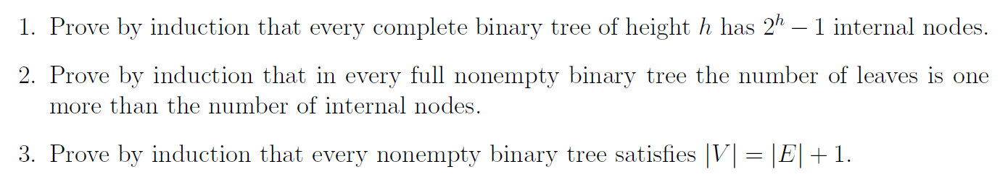
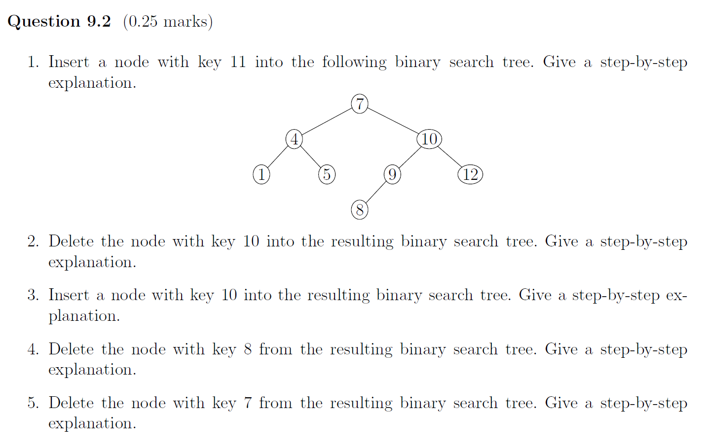
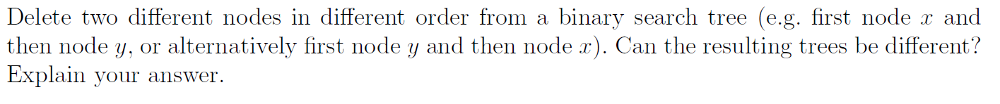
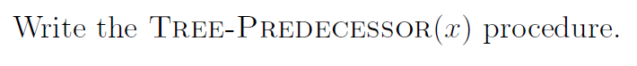
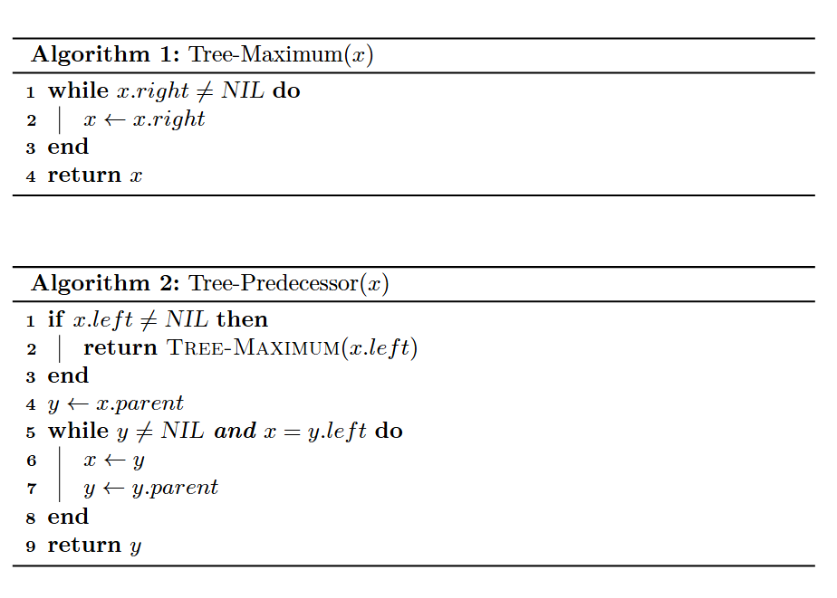
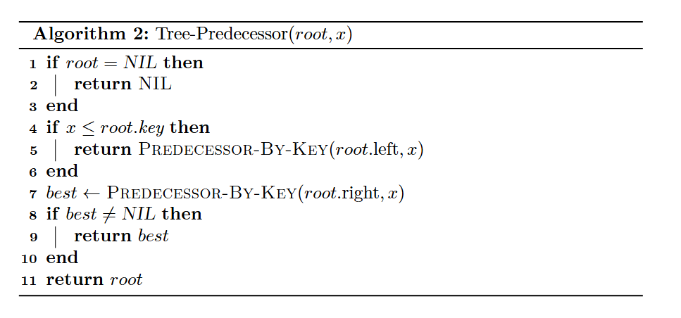
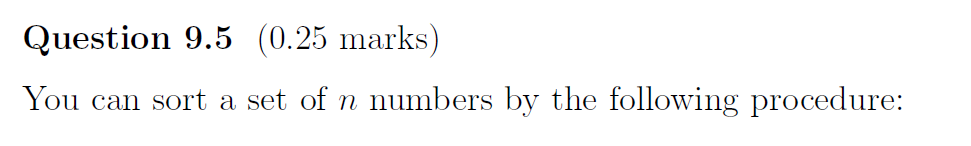
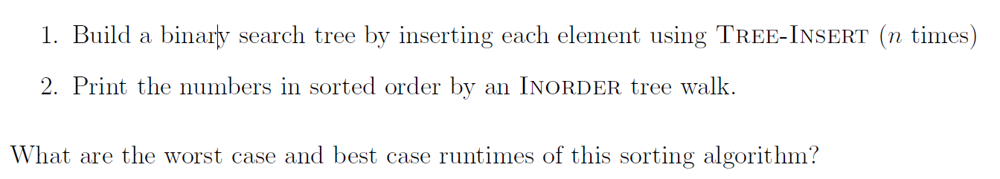
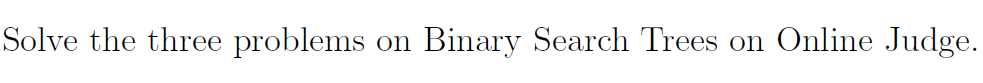
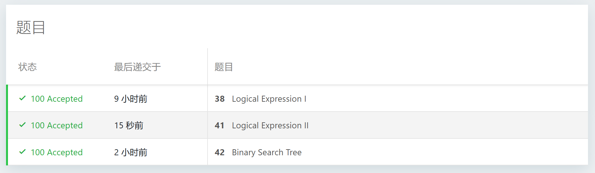

# Assignment IX - DSAA(H)

**Name**: Yuxuan HOU (侯宇轩)

**Student ID**: 12413104

**Date**: 2025.11.10

## Question 9.1 (1 mark)



PF:

1. Base $$h=0$$: internal $$0=2^{0}-1$$. 
   Step: two complete subtrees of height $$h-1$$, then $$I = 1+2\,(2^{h-1}-1)=2^{h}-1$$. 

   $\texttt{Q.E.D.}$.

2. Base: single node $$L=1, I=0$$. 
   Step: subtrees $$T_L,T_R$$ and $$L(T_L)=I(T_L)+1$$, $$L(T_R)=I(T_R)+1$$, then $$L=L(T_L)+L(T_R)=I(T_L)+I(T_R)+2=I+1$$. 

   $\texttt{Q.E.D.}$.

3. Base $$1=0+1$$. 
   Step: Remove a leaf, then $$|V'|=|V|-1$$ and $$|E'|=|E|-1$$. By $$|V'|=|E'|+1$$, thus $$|V|=|E|+1$$.

   $\texttt{Q.E.D.}$.

## Question 9.2 (0.25 marks)



Sol: 

1. 

- Compare with 7 → go right to 10.
- 11 > 10 → go right to 12.
- 11 < 12 and 12's left is NIL → insert as left child of 12.

```
        7
      /   \
     4     10
    / \   /  \
   1   5 9   12
        /   /
       8   11
```

2. 

- Node 10 has two children. The min of right subtree is 11.
- Splice 11 out of under 12.
- Replace 10 by 11; set 11.left ← 9, 11.right ← 12.

```
        7
      /   \
     4     11
    / \   /  \
   1   5 9   12
        /
       8
```

3. 

- 10 > 7 → go right to 11.
- 10 < 11 → go left to 9.
- 10 > 9 and 9.right is NIL → insert as right child of 9.

```
        7
      /   \
     4     11
    / \   /  \
   1   5 9   12
        / \
       8  10
```

4. 

- 8 is a leaf → remove directly.

```
        7
      /   \
     4     11
    / \   /  \
   1   5 9   12
          \
          10
```

5. 

- Root 7 has two children. Min of right subtree: from 11 go left to 9 (now left is NIL), then it's 9.
- Splice 9 out by linking its right child 10 up to 11.left.
- Replace 7 by 9, set 9.left ← 4, 9.right ← 11.

```
        9
      /   \
     4     11
    / \   /  \
   1   5 10  12
```

## Question 9.3 (0.25 marks)



Sol: That will cause different shapes.
Reason: Deleting a two-child node replaces it by its successor or predecessor and performs transplants along that path, if the other key lies on or near that path, the first deletion changes which successor or predecessor the second uses, so the final structure is differ.

For instance, when y is the successor of x, and y has right child.

## Question 9.4 (0.25 marks)

 

Sol: 



Tips: Implement Tree-Predecessor from root, we can find the predecessor without parent pointer:



## Question 9.5 (0.25 marks)





Sol:

- Worst case: $$\Theta(n^2)$$.

  Let chain height \(h_t=t\), build \(\sum_{t=0}^{n-1}(t+1)=\Theta(n^2)\).

- Best case: $$\Theta(n\log n)$$.

  With balanced heights \(h_t=\Theta(\log t)\), build \(\sum \Theta(\log t)=\Theta(n\log n)\).

## Question 9.6 (1 mark)





```cpp
int main(){

    int T = read();
    while(T--){
        string S; cin >> S;
        stack < char > cur;
        for(int i = 0; i < S.size(); ++i){
            char c = S.at(i);
            if(c == '-')++i, cur.push('>');
            else if(c != ')')cur.push(c);
            else{
                char v2 = cur.top(); cur.pop();
                
                if(!cur.empty() && cur.top() == '!'){
                    cur.pop();
                    if (!cur.empty() && cur.top() == '(')cur.pop();
                    cur.push(v2 == '1' ? '0' : '1');
                }else{
                    char op = cur.top(); cur.pop();
                    char v1 = cur.top(); cur.pop();
                    if (!cur.empty() && cur.top() == '(') cur.pop();
                    bool a = v1 == '1', b = v2 == '1', r(false);
                    switch(op){
                        case '&': r = a & b; break;
                        case '|': r = a | b; break;
                        case '^': r = a ^ b; break;
                        case '>': r = (!a) | b; break;
                    }
                    cur.push(r ? '1' : '0');
                }
                
            }
        }printf("%c\n", cur.top());
    }

    // fprintf(stderr, "Time: %.6lf\n", (double)clock() / CLOCKS_PER_SEC);
    return 0;
}
```

```cpp
struct Edge{
    Edge* nxt;
    int to;
};

const int LIM = 1100000;

int main(){
    vector < int > A(LIM, 0);
    vector < int > label(LIM, 0);
    vector < int > res(LIM, 0);
    vector < Edge* > head(LIM, nullptr);
    vector < int > L(LIM, 0), R(LIM, 0);
    vector < int > flag(LIM, 0), flag2(LIM, 0), F(LIM, 0);

    string S;
    stack < int > cur;
    int N(0), cnt(0); 
    while(cin >> S){
        if(!S.empty() && isdigit(S[0])){N = stoi(S); break;}
        if(S == "!"){
            if(!cur.empty()){
                int tp = cur.top();
                if(tp > 0) flag2[tp] ^= 1;
                else flag[-tp] ^= 1;
            }
        }else if(S[0] == 'x'){
            int val(0);
            for(int i = 1; i < (int)S.length(); ++i)
                val = val * 10 + int(S[i] - '0');
            cur.push(val);
        }else if(S == "&" || S == "|"){
            int y = cur.top(); cur.pop();
            int x = cur.top(); cur.pop();
            label[++cnt] = (S == "&" ? 2 : 3);
            L[cnt] = x; R[cnt] = y;
            cur.push(-cnt);
        }
    }

    for(int i = 1; i <= N; ++i)A[i] = read();

    auto mapID = [&](int t)->int{return t > 0 ? t : (N + (-t));};

    int root = cur.empty() ? N : mapID(cur.top());
    int Q = read();

    for(int i = 1; i <= N; ++i)F[i] = flag2[i];
    for(int i = 1; i <= cnt; ++i){
        int p = N + i;
        F[p] = flag[i];
        A[p] = label[i];
        head[p] = new Edge{head[p], mapID(L[i])};
        head[p] = new Edge{head[p], mapID(R[i])};
    }

    vector < char > vis(LIM, 0), vis2(LIM, 0);
    vector < int > val(LIM, 0);

    auto dfs = [&](auto&& self, int p, int g)->int{
        if(p <= N)return A[p] ^ g;
        if(vis[p])return val[p];
        vis[p] = 1;

        int c1(-1), c2(-1), k(0);
        for(auto i = head[p]; i && k < 2; i = i->nxt)
            (k++) == 0 ? c1 = i->to : c2 = i->to;
        int rs = c1, ls = c2;
        int x = self(self, ls, g ^ F[ls]);
        int y = self(self, rs, g ^ F[rs]);

        int opt = (A[p] ^ g);
        if(opt == 2){
            if(!x)res[rs] = 1;
            if(!y)res[ls] = 1;
            val[p] = (x & y);
        }else{
            if(x == 1)res[rs] = 1;
            if(y == 1)res[ls] = 1;
            val[p] = (x | y);
        }
        return val[p];
    };

    auto dfs2 = [&](auto&& self, int p)->void{
        if(p <= N)return;
        if(vis2[p])return;
        vis2[p] = 1;
        for(auto i = head[p]; i; i = i->nxt){
            res[i->to] |= res[p];
            self(self, i->to);
        }
    };

    int ans = dfs(dfs, root, F[root]);
    dfs2(dfs2, root);

    while(Q--)printf("%d\n", res[read()] ? ans : !ans);

    return 0;
}
```

```cpp
class Node{
public:
    Node *ls, *rs;
    int val, siz, cnt;
};

Node* root;

#define siz(p) ((p) ? (p)->siz : 0)
class Tree{
private:
public:
    void Pushup(Node* p){
        if(!p)return;
        p->siz = siz(p->ls) + siz(p->rs) + p->cnt;
    }
    Node* QueryMx(Node* p = root){
        if(!p)return p;
        if(p->rs)return QueryMx(p->rs);
        return p;
    }
    Node* QueryMn(Node* p = root){
        if(!p)return p;
        if(p->ls)return QueryMn(p->ls);
        return p;
    }
    Node* Insert(int val, Node* p = root){
        if(!p)return new Node{nullptr, nullptr, val, 1, 1};
        if(val < p->val)p->ls = Insert(val, p->ls);
        else if(val > p->val)p->rs = Insert(val, p->rs);
        else ++p->cnt;
        Pushup(p);
        return p;
    };
    Node* Delete(int val, Node* p = root){
        if(!p)return p;
        if(val < p->val)p->ls = Delete(val, p->ls);
        else if(val > p->val)p->rs = Delete(val, p->rs);
        else{
            if(p->cnt > 1)--p->cnt;
            else{
                if(!p->ls)delete exchange(p, p->rs);
                else if(!p->rs)delete exchange(p, p->ls);
                else{
                    auto succ = QueryMn(p->rs);
                    p->val = succ->val, p->cnt = succ->cnt;
                    succ->cnt = 1;
                    p->rs = Delete(succ->val, p->rs);
                }
            }
        }Pushup(p); return p;
    }
    int QueryRnk(int val, Node* p = root){
        if(!p)return 0;
        if(val == p->val)return siz(p->ls);
        if(val < p->val)return QueryRnk(val, p->ls);
        return siz(p->ls) + p->cnt + QueryRnk(val, p->rs);
    }
    Node* QueryByRnk(int rnk, Node* p = root){
        if(!p)return p;
        // printf("l siz = %d, rnk = %d, cnt = %d\n", siz(p->ls), rnk, p->cnt); fflush(stdout);
        if(siz(p->ls) + 1 <= rnk && rnk <= siz(p->ls) + p->cnt)return p;
        if(rnk <= siz(p->ls))return QueryByRnk(rnk, p->ls);
        return QueryByRnk(rnk - siz(p->ls) - p->cnt, p->rs);
    }
    Node* QuerySuc(int val, Node* p = root){
        if(!p)return p;
        if(val >= p->val)return QuerySuc(val, p->rs);
        auto res = QuerySuc(val, p->ls);
        return res ? res : p;
    }
    Node* QueryPre(int val, Node* p = root){
        if(!p)return p;
        if(val <= p->val)return QueryPre(val, p->ls);
        auto res = QueryPre(val, p->rs);
        return res ? res : p;
    }
}tr;

int main(){
    int T = read();
    while(T--){
        int opt = read(), val = read();
        switch(opt){
            case 1: root = tr.Insert(val); break;
            case 2: root = tr.Delete(val); break;
            case 3: printf("%d\n", tr.QueryRnk(val) + 1); break;
            case 4: printf("%d\n", tr.QueryByRnk(val)->val); break;
            case 5: printf("%d\n", tr.QueryPre(val)->val); break;
            case 6: printf("%d\n", tr.QuerySuc(val)->val); break;
        }
    }

    // fprintf(stderr, "Time: %.6lf\n", (double)clock() / CLOCKS_PER_SEC);
    return 0;
}

```
