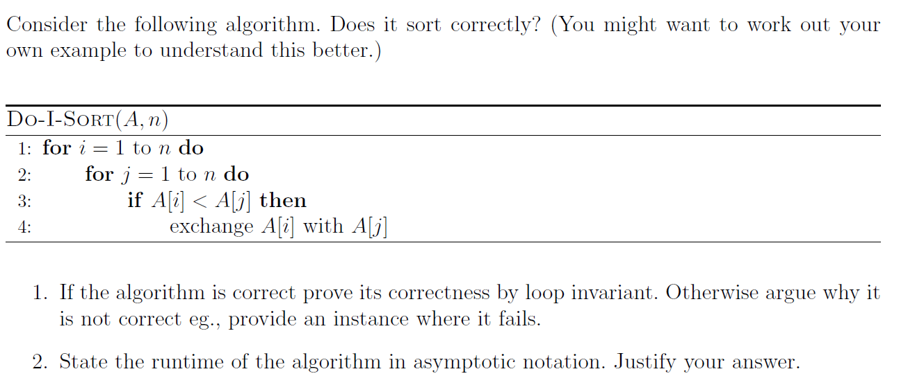
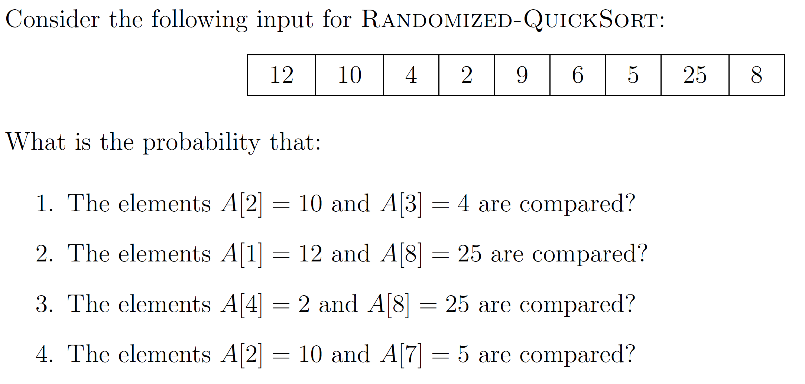
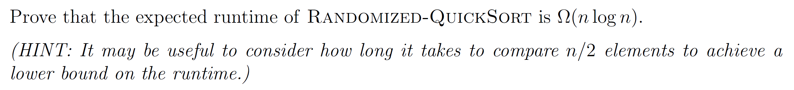
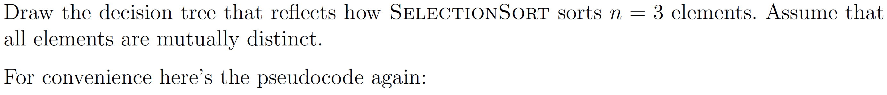
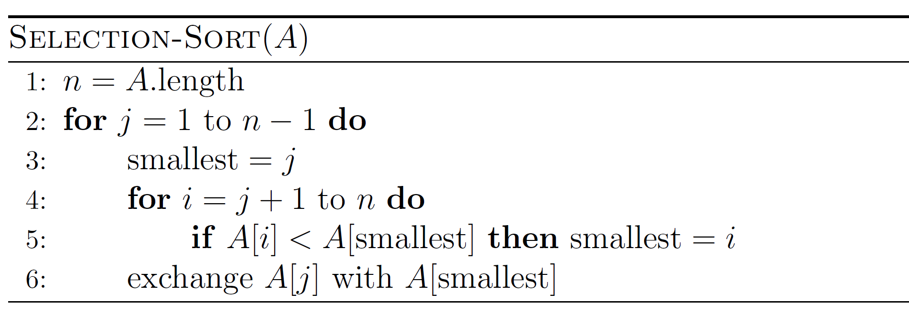
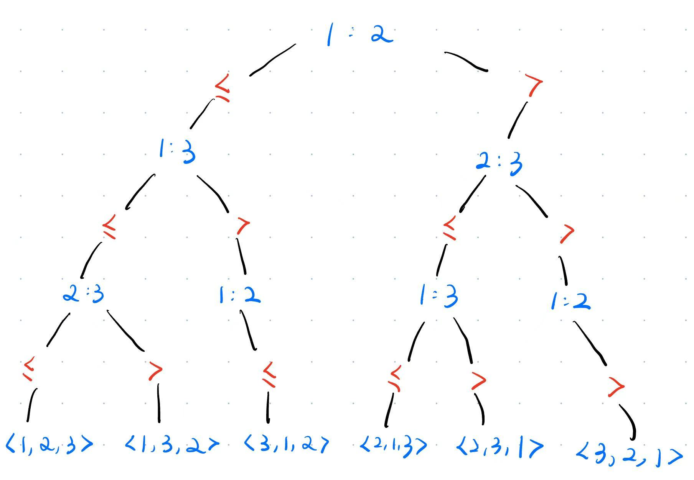
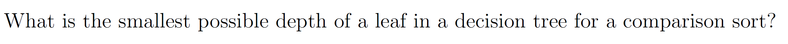
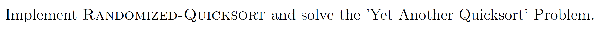

# Assignment VI - DSAA(H)

**Name**: Yuxuan HOU (侯宇轩)

**Student ID**: 12413104

**Date**: 2025.10.21

## Question 6.1 (marks 0.5)



Sol: The algorithm is **correct**.

1. 

**Inner Loop Invariant**: Before each iteration $j$, the element $A[i]$ is greater than every elements in $A[1, j - 1]$.

- **Initialization**: At the beginning, $j - 1 = 0$, the loop invariant is trivially satisfied.

- **Maintenance**: In the iteration, if $A[j] > A[i]$, they will be swaped, leading that $A[i]$ remains to be the greatest.

- **Termination**: When $j = n$, the loop terminate, and $A[i]$ will be the largest element of $A[1, n]$.

**Outer Loop Invariant**: Before each iteration $i$, the prefix $A[1, i - 1]$ is non-decreasing.

- **Initialization**: At the beginning, $i - 1 = 0$, the loop invariant is trivially satisfied.

- **Maintenance**: In the iteration, after the inner loop, $A[i]$ will become the greatest. And the larger elements will only be moved rightwards. Therefore $A[1, i]$ will be non-decreasing.

- **Termination**: When $i = n$, the loop terminate, and $A[1, n]$ will become non-decreasing, which is ordered.

2. The runtime is $\Theta(n^2)$. For the two loops are both from $1$ to $n$, which leads to $n^2$ swaps or comparisons which is $\Theta(1)$,  thus the total runtime is $\Theta(n^2)$.

## Question 6.2 (0.5 marks)



PF:

**Lemma I:** Denoting the elements in sorted array as $z_i$, the probility of comparison between $z_i, z_j, i < j$ is $\dfrac{2}{j - i + 1}$.

**Proof:**

- If pivot $x$ s.t. $𝑥 < 𝑧_i$ or $x > z_j$ then the decision whether to do comparison is postponed to a recursive call.
- If pivot is $x = z_i$ or $x = z_j$, both $z_i, z_j$ will be compared.
- If pivot is $z_i < x < z_j$ then both $z_i, z_j$ will be compared and become separated, then never be compared!
- Thus the probility is $\dfrac{2}{j - i + 1}$.

According to Lemma I:

We can sort $A$, we have $2, 4, 5, 6, 8, 9, 10, 12, 25$.

Then for $z_i$, we have $8, 7, 2, 1, 6, 4, 3, 9, 5$.

Therefore:

1. $i = 2, j = 7$, $\dfrac{2}{7 - 2 + 1} = \dfrac{1}{3}$.
2. $i = 8, j = 9$, $\dfrac{2}{9 - 8 + 1} = 1$.
3. $i = 1, j = 9$, $\dfrac{2}{9 - 1 + 1} = \dfrac{2}{9}$.
4. $i = 3, j = 7$, $\dfrac{2}{7 - 3 + 1} = \dfrac{2}{5}$.

## Question 6.3 (1 mark)



PF:

**Lemma I:** Denoting the elements in sorted array as $z_i$, the probility of comparison between $z_i, z_j, i < j$ is $\dfrac{2}{j - i + 1}$.

**Proof:**

- If pivot $x$ s.t. $𝑥 < 𝑧_i$ or $x > z_j$ then the decision whether to do comparison is postponed to a recursive call.
- If pivot is $x = z_i$ or $x = z_j$, both $z_i, z_j$ will be compared.
- If pivot is $z_i < x < z_j$ then both $z_i, z_j$ will be compared and become separated, then never be compared!
- Thus the probility is $\dfrac{2}{j - i + 1}$.

Obviously, we can represent the runtime by comparison times $X_n$, for the other works are all low-order.

Denoting the elements in sorted array as $z_i$, let $X_{i, j}$ be the comparison times between $i, j$.

We have $X_{i, j} = \dfrac{2}{j - i + 1}, i < j$, according to Lemma I.

Thus:
$$
\begin{aligned}
    E(X) &= \sum_{i < j} X_{i, j} \\
    &= \sum_{i < j}\dfrac{2}{j - i + 1} \\
    &= \sum_{k = 1}^{n - 1}(n - k)\cdot \dfrac{2}{k + 1} \\
    &\ge \sum_{k = 1}^{\lfloor \frac{n}{2} \rfloor} \dfrac{n}{2} \cdot \dfrac{1}{k} \\
    &= n \sum_{k = 2}^{\lfloor \frac{n}{2} \rfloor + 1}\dfrac{1}{k} \\
    &= n \cdot \Theta(\log n) \\
    &= \Theta(n \log n)
\end{aligned}
$$
Therefore, $E(X) \ge \Theta(n \log n)$, i.e., $\Omega(n \log n)$.

$\texttt{Q.E.D.}$.

## Question 6.4 (1 mark)

 



Sol:



## Question 6.5 (0.5 marks)



Sol: Obvoiusly it's $n - 1$.

We obtain that each comparison represents one depth deeper, and if we want to finish a comparison sort, we need to clarify the minimum element at least. And the process of clarifying the minimum needs at least $n - 1$ comparisons, thus the smallest possible depth is $n - 1$.

## Question 6.6 (0.25 marks)




```cpp
int main(){
    int N = read();
    vector < int > A(N + 10, 0);
    for(int i = 1; i <= N; ++i)A[i] = read();
    auto Partition = [](vector < int > &A, int l, int r)->int{
        int val(A[r]);
        int spl(l - 1);
        for(int i = l; i <= r - 1; ++i)
            if(A[i] <= val)swap(A[++spl], A[i]);
        swap(A[++spl], A[r]);
        return spl;
    };
    auto RandPartition = [&](vector < int > &A, int l, int r)->int{
        swap(A[r], A[rndd(l, r)]);
        return Partition(A, l, r);
    };
    auto RandQuickSort = [&](auto&& self, vector < int > &A, int l, int r)->void{
        if(l >= r)return;
        int spl = RandPartition(A, l, r);
        self(self, A, l, spl - 1);
        self(self, A, spl + 1, r);
    }; RandQuickSort(RandQuickSort, A, 1, N);

    for(int i = 1; i <= N; ++i)printf("%d%c", A[i], i == N ? '\n' : ' ');

    // fprintf(stderr, "Time: %.6lf\n", (double)clock() / CLOCKS_PER_SEC);
    return 0;
}
```

```cpp
int N;

class SegTree{
private:
    int mn[510000 << 2], mx[510000 << 2];
    #define LS (p << 1)
    #define RS (LS | 1)
    #define MID ((gl + gr) >> 1)
public:
    void Clear(void){
        for(int i = 0; i <= (N << 2) + 100; ++i)mn[i] = INT_MAX, mx[i] = INT_MIN;
    }
    void Pushup(int p){
        mn[p] = min(mn[LS], mn[RS]);
        mx[p] = max(mx[LS], mx[RS]);
    }
    void Modify(int pos, int val, int p = 1, int gl = 1, int gr = N){
        if(gl == gr)return mx[p] = mn[p] = val, void();
        if(pos <= MID)Modify(pos, val, LS, gl, MID);
        else Modify(pos, val, RS, MID + 1, gr);
        Pushup(p);
    }
    int QueryGreaterThan(int val, int l, int r, int p = 1, int gl = 1, int gr = N){
        if(gr < l || gl > r)return -1;
        if(gl == gr)return mx[p] >= val ? gl : -1;
        int ret(-1);
        if(l <= MID && mx[LS] >= val)ret = QueryGreaterThan(val, l, r, LS, gl, MID);
        if(!~ret && r >= MID + 1)ret = QueryGreaterThan(val, l, r, RS, MID + 1, gr);
        return ret;
    }
    int QueryLessThan(int val, int l, int r, int p = 1, int gl = 1, int gr = N){
        if(gr < l || gl > r)return -1;
        if(gl == gr)return mn[p] <= val ? gl : -1;
        int ret(-1);
        if(r >= MID + 1 && mn[RS] <= val)ret = QueryLessThan(val, l, r, RS, MID + 1, gr);
        if(!~ret && l <= MID)ret = QueryLessThan(val, l, r, LS, gl, MID);
        return ret;
    }
}st;

int main(){
    int T = read();
    while(T--){
        ll res(0);
        N = read();
        st.Clear();
        vector < int > A(N + 10, 0);
        for(int i = 1; i <= N; ++i)st.Modify(i, A[i] = read());
        auto Partition = [&](vector < int > &A, int l, int r)->int{
            int pivot = A[(l + r) >> 1];
            int i(l - 1), j(r + 1);
            while(true){
                i = st.QueryGreaterThan(pivot, i + 1, r);
                j = st.QueryLessThan(pivot, l, j - 1);
                i = !~i ? r + 1 : i;
                j = !~j ? l - 1 : j;
                // printf("next i = %d, j = %d\n", i, j);
                if(i >= j)return j;
                ++res;
                st.Modify(i, A[j]);
                st.Modify(j, A[i]);
                swap(A[i], A[j]);
            }
        };
        auto QuickSort = [&](auto&& self, vector < int > &A, int l, int r)->void{
            if(l >= r)return;
            int spl = Partition(A, l, r);
            self(self, A, l, spl);
            self(self, A, spl + 1, r);
        }; QuickSort(QuickSort, A, 1, N);
        printf("%lld\n", res);
    }

    // fprintf(stderr, "Time: %.6lf\n", (double)clock() / CLOCKS_PER_SEC);
    return 0;
}
```

