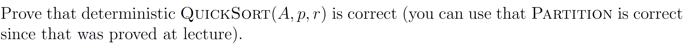
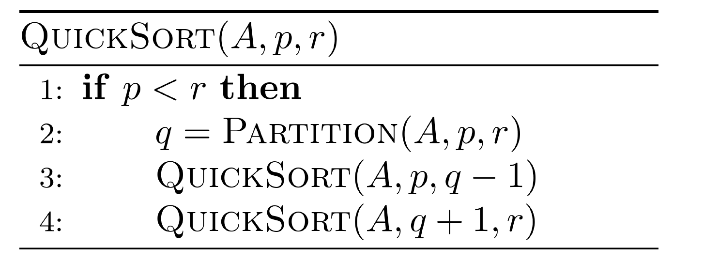
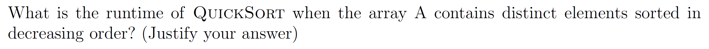
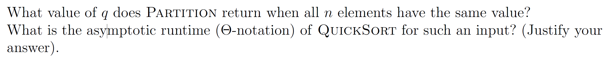
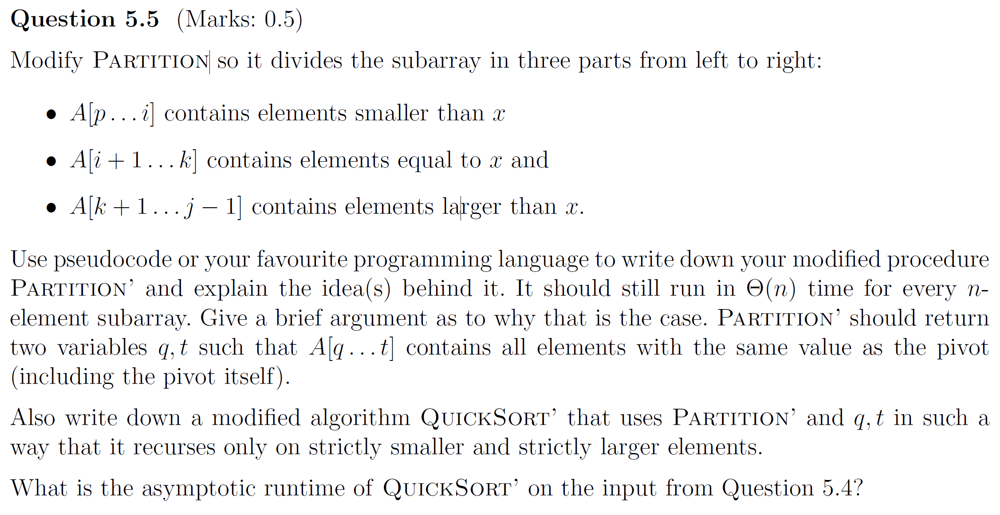
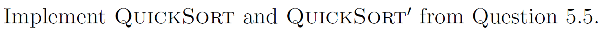

# Assignment VI - DSAA(H)

**Name**: Yuxuan HOU (侯宇轩)

**Student ID**: 12413104

**Date**: 2025.10.21

## Question 6.1 (marks 0.5)


Sol: 


## Question 5.2 (Marks: 0.5)





PF:

**Recursive Invariant**: In each recursion, after `Partition(A, p, r)`, $A[p, q - 1] \le A[q] \le A[q + 1, r]$, and the following recursions only affect the two sides.

**Initialization**: At the beginning of recursion, the function will directly return if $p \ge r$, which is trivially correct. Otherwise satisfies the invariant due to the correctness of  `Partition(A, p, r)`.

**Maintenance**: The following two recurisons make $A[p, q - 1]$ and $A[q + 1, r]$ ordered, and  `Partition(A, p, r)` make sure $A[p, q - 1] \le A[q] \le A[q + 1, r]$, thus the array $A[p, r]$ will be ordered.

**Termination**: $r - p$ will trivially decrease, and when $p \ge r$, the recursion will terminate.

$\texttt{Q.E.D.}$.

## Question 5.3 (Marks: 0.25)



Sol:

Obviously the case in description is the worst case, whose runtime is $\Theta(n^2)$.

Justification: Each partition will pick the minimum element as pivot, leaving the worst partition $(1, n - 1)$, and the Partition itself is linear.

Thus we have: $T(n) = T(n - 1) + \Theta(n)$, then solve it by substitution, we obtain $T(n) = \Theta(n^2)$.

## Question 5.4 (Marks: 0.5)

 	

Sol: $q = r$, for each elements satisfy $A[j] \le x$, thus $i \leftarrow i + 1$ will always be executed, thus Partition will return $r$.

The runtime will be $\Theta(n^2)$, similiar to Question 5.3, this situation will leave the worst partition $(1, n - 1)$, and the Partition itself is linear. Thus we have: $T(n) = T(n - 1) + \Theta(n)$, then solve it by substitution, we obtain $T(n) = \Theta(n^2)$.

## Question 5.5 (Marks: 0.5)



Sol:

Code in C++:

```cpp
auto Partition = [](vector < int > &A, int l, int r)->pair < int, int >{
    int pivot(A[r]);
    int spl1(l - 1), spl2(r - 1);
    int cur(l);
    while(cur <= spl2){
        if(A[cur] < pivot)swap(A[++spl1], A[cur++]);
        else if(A[cur] > pivot)swap(A[cur], A[spl2--]);
        else ++cur;
    }
    swap(A[++spl2], A[r]);
    return {spl1 + 1, spl2};
};
```

Explaination: `cur` will traverse each elements in $A[l, r - 1]$, if it's less than pivot, then $spl1 \leftarrow spl1 + 1$, and we implement the swap, i.e., the element will be placed in the less range. Simutaneously, if it's larger, it will be replaced to the last $spl2$, which is the edge of the larger range. And for equal elements will be left between the two $spl$. Finally, swap the pivot to the rightest of the middle range. Therefore, we have $A[l, spl1] < A[spl1 + 1, spl2] < A[spl2 + 1, r]$, which satisfy the description, and the runtime is trivially linear, for $spl2 - cur$ will definitely decrease in each while loop dur to the `cur++`, `spl2--` and `++cur`, thus the algorithm must terminate in linear runtime.

Code in C++:

```cpp
auto QuickSort = [&](auto&& self, vector < int > &A, int l, int r)->void{
    if(l >= r)return;
    auto [spl1, spl2] = Partition(A, l, r);
    self(self, A, l, spl1 - 1);
    self(self, A, spl2 + 1, r);
};
```

The runtime will be $\Theta(n)$, for Partition' will return `{l, r}` because all the elements are equal to the pivot, then the QuickSort' will not enter the recursion. Thus the runtime will only be once of the Partition'. which is $\Theta(n)$. 

## Question 5.6 (Marks: 0.5)




```cpp
int main(){
    int N = read();
    vector < int > A(N + 10, 0);
    for(int i = 1; i <= N; ++i)A[i] = read();
    auto Partition = [](vector < int > &A, int l, int r)->int{
        int val(A[r]);
        int spl(l - 1);
        for(int i = l; i <= r - 1; ++i)
            if(A[i] <= val)swap(A[++spl], A[i]);
        swap(A[++spl], A[r]);
        return spl;
    };
    auto QuickSort = [&](auto&& self, vector < int > &A, int l, int r)->void{
        if(l >= r)return;
        int spl = Partition(A, l, r);
        self(self, A, l, spl - 1);
        self(self, A, spl + 1, r);
    }; QuickSort(QuickSort, A, 1, N);

    for(int i = 1; i <= N; ++i)printf("%d%c", A[i], i == N ? '\n' : ' ');

    // fprintf(stderr, "Time: %.6lf\n", (double)clock() / CLOCKS_PER_SEC);
    return 0;
}
```

```cpp
int main(){
    int N = read();
    vector < int > A(N + 10, 0);
    for(int i = 1; i <= N; ++i)A[i] = read();
    auto Partition = [](vector < int > &A, int l, int r)->pair < int, int >{
        int pivot(A[r]);
        int spl1(l - 1), spl2(r - 1);
        int cur(l);
        while(cur <= spl2){
            if(A[cur] < pivot)swap(A[++spl1], A[cur++]);
            else if(A[cur] > pivot)swap(A[cur], A[spl2--]);
            else ++cur;
        }
        swap(A[++spl2], A[r]);
        return {spl1 + 1, spl2};
    };
    auto QuickSort = [&](auto&& self, vector < int > &A, int l, int r)->void{
        if(l >= r)return;
        auto [spl1, spl2] = Partition(A, l, r);
        self(self, A, l, spl1 - 1);
        self(self, A, spl2 + 1, r);
    }; QuickSort(QuickSort, A, 1, N);

    for(int i = 1; i <= N; ++i)printf("%d%c", A[i], i == N ? '\n' : ' ');

    // fprintf(stderr, "Time: %.6lf\n", (double)clock() / CLOCKS_PER_SEC);
    return 0;
}

```

