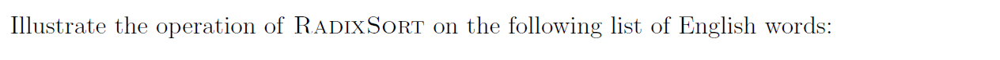
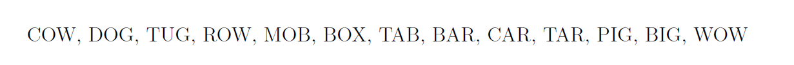
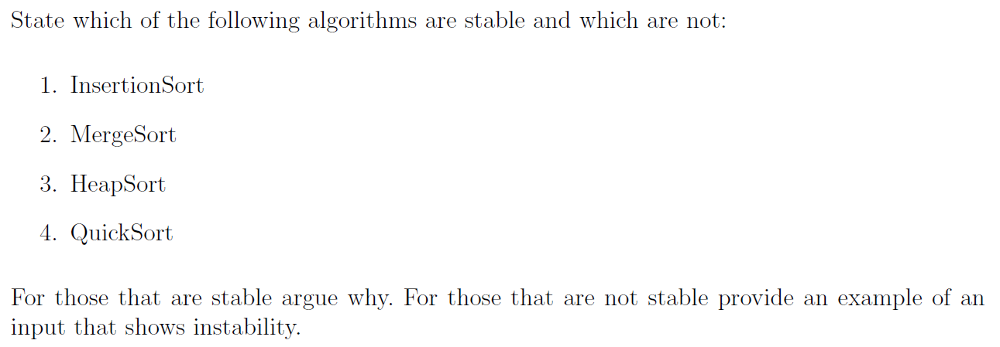
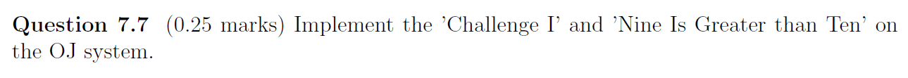
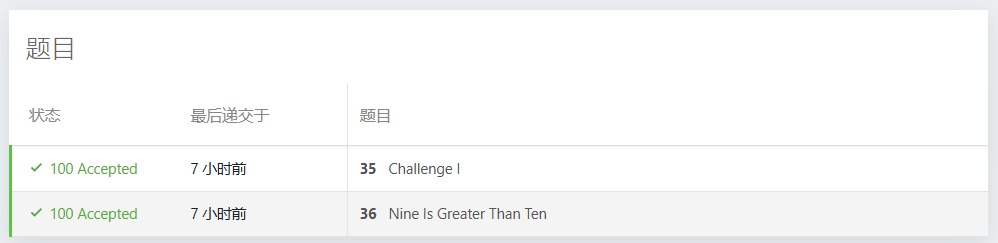

# Assignment VII - DSAA(H)

**Name**: Yuxuan HOU (侯宇轩)

**Student ID**: 12413104

**Date**: 2025.10.27

## Question 7.1 (0.25 marks)


Sol: 

1. Loop I: `0, 0, 0, 0`.
2. Loop II: `2, 3, 1, 1`.
3. Loop III: `2, 5, 6, 7`.
4. Loop IV:
    1. B: `_, _, _, _, 1, _, _`, C: `2, 4, 6, 7`.
    2. B: `_, _, _, 1, 1, _, _`, C: `2, 3, 6, 7`.
    3. B: `_, _, _, 1, 1, _, 3`, C: `2, 3, 6, 6`.
    4. B: `_, _, 1, 1, 1, _, 3`, C: `2, 2, 6, 6`.
    5. B: `_, 0, 1, 1, 1, _, 3`, C: `1, 2, 6, 6`.
    6. B: `_, 0, 1, 1, 1, 2, 3`, C: `1, 2, 5, 6`.
    7. B: `0, 0, 1, 1, 1, 2, 3`, C: `0, 2, 5, 6`.

## Question 7.2 (0.25 marks)


PF:

**Loop Invariant**: After j-th iteration of for loop in lines 6-7, the subarray $C[1, i]$ contains in each position $C[i], i \in [1, j]$ the number of elements less than or equal to i.

**Initialization**: Before entering the loop, $i = 0$, then the empty subarray is trivially satisfy the loop invariant.

**Maintenance**: Before the i-th loop, $C[i - 1]$ contains the number of elements $\le i - 1$, and $C[i] \leftarrow C[i - 1] + C[i]$, which adds the elements equal to $i$ with $\le i - 1$, therefore $C[i]$ represents the elements that $\le i$.

**Termination**: After k-th iteration, the loop terminates. Then the whole array $C$ contains in each position $C[i]$ the number of elements less than or equal to i.

$\texttt{Q.E.D.}$.

## Question 7.3 (0.25 marks)


Sol: The algorithm will not be stable but will sort the numbers.

The target range of elements equal to $i$ is still $B[C[i - 1] + 1, C[i]]$, i.e., all these equal elements will still be placed at the same range but different order, thus it's still **ordered**.

But for the stability, we are using $C[i] \leftarrow C[i] - 1$ in the loop, thus the elements leftside will be placed to right for the iteration is from $1$ to $A.length$, thus the equal elements are reversed, which is **unstable**.

## Question 7.4 (marks:0.5)

 

Sol:


Explaination: We are using `CountingRange-Init` to preprocess the prefix summations of $C[i]$, obviously its runtime is $\Theta(n + k)$. For queries, use `CountingRange-Query`, which can return the answer by subtraction on prefix summations $S$ in $\Theta(1)$ runtime.

## Question 7.5 (marks 0.25)





Sol: 

1. StableSort by 3rd letter:

Bucket: $B < G < R < W < X$.

Result: $\text{MOB, TAB, DOG, TUG, PIG, BIG, BAR, CAR, TAR, COW, ROW, WOW, BOX}$.

2. StableSort by 2nd letter:

Bucket: $A < I < O < U$.

Result: $\text{TAB, BAR, CAR, TAR, PIG, BIG, MOB, DOG, COW, ROW, WOW, BOX, TUG}$.

3. StableSort by 1st letter:

Bucket: $B < C < D < M < P < R < T < W$.

Result: $\text{BAR, BIG, BOX, CAR, COW, DOG, MOB, PIG, ROW, TAB, TAR, TUG, WOW}$.

## Question 7.6 (0.25 marks)



Sol:

1. **Stable**.

Take ascendent as example, the process of insertion is from right to left, and insert the element $A[i]$ when meeting the first $A[j] <= A[i]$, which make sure that the later elements will be placed righter, which holds stability.

2. **Stable**.

In MergeSort, we'll choose the elements in the left subarray first, which make sure the earlier elements will be placed lefter, which holds stability.

3. **Unstable**.

Example: $1, 2_1, 2_2$.

First we implement `Build-Max-Heap` which will implement `Max-Heapify(A, 1)`, then $2_2$ will be swaped to $1$ as the largest. Eventually by `HeapSort` we'll get $2_2, 2_1, 1$ which is obviously unstable.

4. **Unstable**.

Example: $2_1, 2_2, 1$.

$1$ will be chosen as pivot, and $2_1$ will be swaped with $1$, leading $1, 2_2, 2_1$, and when dealing with $2_2, 2_1$, the pivot $2_1$ will be swaped with itself, leading the final result: $1, 2_2, 2_1$, which is obviously unstable.

## Question 7.7 (0.25 marks)





```cpp
using namespace std;
auto Sort = [](u32 *A, int N)->void{
    vector < basic_string < u32 > > buc(1 << 9);
    for(int base = 1; base <= 4; ++base){
        for(int i = 0; i < N; ++i)
            buc[(A[i] >> (8 * (base - 1))) & ((1u << 9) - 1)] += A[i];
        int cur(0);
        for(auto &b : buc){
            for(const auto &v : b)
                A[cur++] = v;
            b.clear();
        }
    }
};
```

```cpp
int main(){
    vector < string > A;
    int N = read();
    int mxlen(0);
    for(int i = 1; i <= N; ++i){
        string S; cin >> S; A.emplace_back(S);
        mxlen = max(mxlen, (int)S.length());
    }
    for(auto &s : A)s += string(mxlen - s.length(), '.');
    sort(A.begin(), A.end());
    for(const auto &s : A){
        for(auto c : s)if(c != '.')printf("%c", c);
        printf("\n");
    }

    // fprintf(stderr, "Time: %.6lf\n", (double)clock() / CLOCKS_PER_SEC);
    return 0;
}
```

