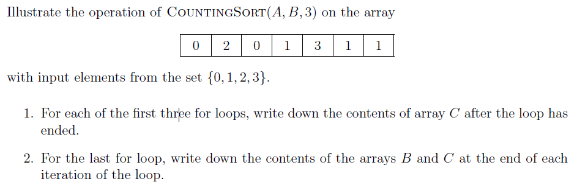
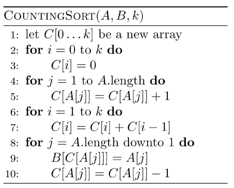
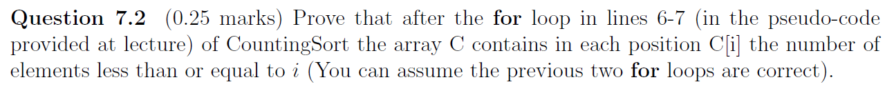
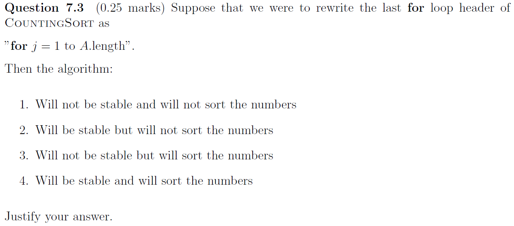
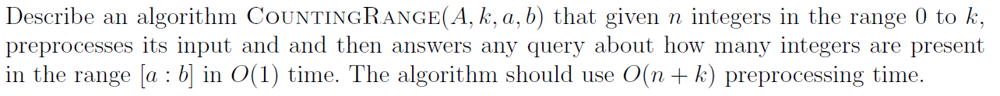
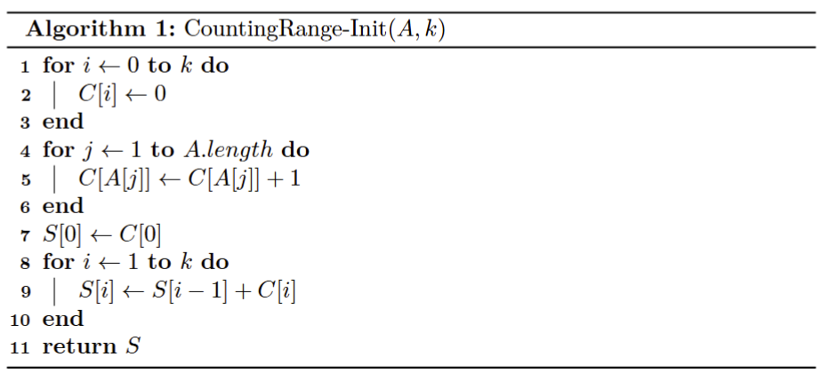
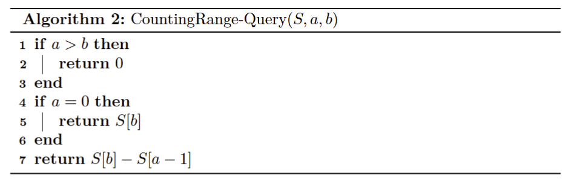

# Assignment VII - DSAA(H)

**Name**: Yuxuan HOU (侯宇轩)

**Student ID**: 12413104

**Date**: 2025.10.27

## Question 7.1 (0.25 marks)





Sol: 

1. Loop I: `0, 0, 0, 0`.
2. Loop II: `2, 3, 1, 1`.
3. Loop III: `2, 5, 6, 7`.
4. Loop IV:
    1. B: `_, _, _, _, 1, _, _`, C: `2, 4, 6, 7`.
    2. B: `_, _, _, 1, 1, _, _`, C: `2, 3, 6, 7`.
    3. B: `_, _, _, 1, 1, _, 3`, C: `2, 3, 6, 6`.
    4. B: `_, _, 1, 1, 1, _, 3`, C: `2, 2, 6, 6`.
    5. B: `_, 0, 1, 1, 1, _, 3`, C: `1, 2, 6, 6`.
    6. B: `_, 0, 1, 1, 1, 2, 3`, C: `1, 2, 5, 6`.
    7. B: `0, 0, 1, 1, 1, 2, 3`, C: `0, 2, 5, 6`.

## Question 7.2 (0.25 marks)



PF:

**Loop Invariant**: After j-th iteration of for loop in lines 6-7, the subarray $C[1, i]$ contains in each position $C[i], i \in [1, j]$ the number of elements less than or equal to i.

**Initialization**: Before entering the loop, $i = 0$, then the empty subarray is trivially satisfy the loop invariant.

**Maintenance**: Before the i-th loop, $C[i - 1]$ contains the number of elements $\le i - 1$, and $C[i] \leftarrow C[i - 1] + C[i]$, which adds the elements equal to $i$ with $\le i - 1$, therefore $C[i]$ represents the elements that $\le i$.

**Termination**: After k-th iteration, the loop terminates. Then the whole array $C$ contains in each position $C[i]$ the number of elements less than or equal to i.

$\texttt{Q.E.D.}$.

## Question 7.3 (0.25 marks)



Sol: The algorithm will not be stable but will sort the numbers.

The target range of elements equal to $i$ is still $B[C[i - 1] + 1, C[i]]$, i.e., all these equal elements will still be placed at the same range but different order, thus it's still **ordered**.

But for the stability, we are using $C[i] \leftarrow C[i] - 1$ in the loop, thus the elements leftside will be placed to right for the iteration is from $1$ to $A.length$, thus the equal elements are reversed, which is **unstable**.

## Question 7.4 (marks:0.5)

 

Sol:





Explaination: We are using `CountingRange-Init` to preprocess the prefix summations of $C[i]$, then 

## Question 6.5 (0.5 marks)


Sol: Obvoiusly it's $n - 1$.

We obtain that each comparison represents one depth deeper, and if we want to finish a comparison sort, we need to clarify the minimum element at least. And the process of clarifying the minimum needs at least $n - 1$ comparisons, thus the smallest possible depth is $n - 1$.

## Question 6.6 (0.25 marks)


```cpp
int main(){
    int N = read();
    vector < int > A(N + 10, 0);
    for(int i = 1; i <= N; ++i)A[i] = read();
    auto Partition = [](vector < int > &A, int l, int r)->int{
        int val(A[r]);
        int spl(l - 1);
        for(int i = l; i <= r - 1; ++i)
            if(A[i] <= val)swap(A[++spl], A[i]);
        swap(A[++spl], A[r]);
        return spl;
    };
    auto RandPartition = [&](vector < int > &A, int l, int r)->int{
        swap(A[r], A[rndd(l, r)]);
        return Partition(A, l, r);
    };
    auto RandQuickSort = [&](auto&& self, vector < int > &A, int l, int r)->void{
        if(l >= r)return;
        int spl = RandPartition(A, l, r);
        self(self, A, l, spl - 1);
        self(self, A, spl + 1, r);
    }; RandQuickSort(RandQuickSort, A, 1, N);

    for(int i = 1; i <= N; ++i)printf("%d%c", A[i], i == N ? '\n' : ' ');

    // fprintf(stderr, "Time: %.6lf\n", (double)clock() / CLOCKS_PER_SEC);
    return 0;
}
```

```cpp
int N;

class SegTree{
private:
    int mn[510000 << 2], mx[510000 << 2];
    #define LS (p << 1)
    #define RS (LS | 1)
    #define MID ((gl + gr) >> 1)
public:
    void Clear(void){
        for(int i = 0; i <= (N << 2) + 100; ++i)mn[i] = INT_MAX, mx[i] = INT_MIN;
    }
    void Pushup(int p){
        mn[p] = min(mn[LS], mn[RS]);
        mx[p] = max(mx[LS], mx[RS]);
    }
    void Modify(int pos, int val, int p = 1, int gl = 1, int gr = N){
        if(gl == gr)return mx[p] = mn[p] = val, void();
        if(pos <= MID)Modify(pos, val, LS, gl, MID);
        else Modify(pos, val, RS, MID + 1, gr);
        Pushup(p);
    }
    int QueryGreaterThan(int val, int l, int r, int p = 1, int gl = 1, int gr = N){
        if(gr < l || gl > r)return -1;
        if(gl == gr)return mx[p] >= val ? gl : -1;
        int ret(-1);
        if(l <= MID && mx[LS] >= val)ret = QueryGreaterThan(val, l, r, LS, gl, MID);
        if(!~ret && r >= MID + 1)ret = QueryGreaterThan(val, l, r, RS, MID + 1, gr);
        return ret;
    }
    int QueryLessThan(int val, int l, int r, int p = 1, int gl = 1, int gr = N){
        if(gr < l || gl > r)return -1;
        if(gl == gr)return mn[p] <= val ? gl : -1;
        int ret(-1);
        if(r >= MID + 1 && mn[RS] <= val)ret = QueryLessThan(val, l, r, RS, MID + 1, gr);
        if(!~ret && l <= MID)ret = QueryLessThan(val, l, r, LS, gl, MID);
        return ret;
    }
}st;

int main(){
    int T = read();
    while(T--){
        ll res(0);
        N = read();
        st.Clear();
        vector < int > A(N + 10, 0);
        for(int i = 1; i <= N; ++i)st.Modify(i, A[i] = read());
        auto Partition = [&](vector < int > &A, int l, int r)->int{
            int pivot = A[(l + r) >> 1];
            int i(l - 1), j(r + 1);
            while(true){
                i = st.QueryGreaterThan(pivot, i + 1, r);
                j = st.QueryLessThan(pivot, l, j - 1);
                i = !~i ? r + 1 : i;
                j = !~j ? l - 1 : j;
                // printf("next i = %d, j = %d\n", i, j);
                if(i >= j)return j;
                ++res;
                st.Modify(i, A[j]);
                st.Modify(j, A[i]);
                swap(A[i], A[j]);
            }
        };
        auto QuickSort = [&](auto&& self, vector < int > &A, int l, int r)->void{
            if(l >= r)return;
            int spl = Partition(A, l, r);
            self(self, A, l, spl);
            self(self, A, spl + 1, r);
        }; QuickSort(QuickSort, A, 1, N);
        printf("%lld\n", res);
    }

    // fprintf(stderr, "Time: %.6lf\n", (double)clock() / CLOCKS_PER_SEC);
    return 0;
}
```

