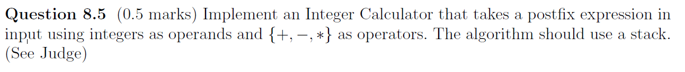
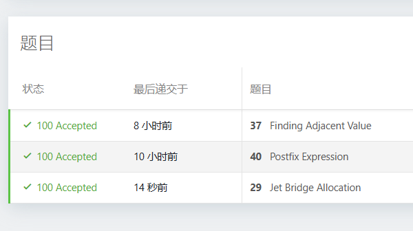
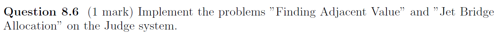

# Assignment X - DSAA(H)

**Name**: Yuxuan HOU (侯宇轩)

**Student ID**: 12413104

**Date**: 2025.11.17

## Question 10.1 (0.5 Marks)


Sol: 


## Question 10.2 (0.5 marks)


## Question 8.5 (0.5 marks)



Sol:



```cpp
int main(){
    int T = read();
    while(T--){
        int N = read();
        stack < int > cur;
        while(N--){
            char c = getchar();
            int val(0);
            bool isd(false);
            while(!isdigit(c) && c != '+' && c != '-' && c != '*')c = getchar();
            while(isdigit(c))isd = true, val = (val * 10) + int(c - '0'), c = getchar();
            if(isd)cur.push(val);
            else{
                int v1 = cur.top(); cur.pop();
                int v2 = cur.top(); cur.pop();
                cur.push(c == '+' ? (v1 + v2) : (c == '-' ? (v2 - v1) : v1 * v2));
            }
        }printf("%d\n", cur.top());
    }

    // fprintf(stderr, "Time: %.6lf\n", (double)clock() / CLOCKS_PER_SEC);
    return 0;
}
```

## Question 8.6 (1 mark)



Sol:


```cpp
struct Node{
    int val;
    int idx;
    Node *left;
    Node *right;
};

int main(){
    int N = read();
    vector < pair < int, int > > A(N + 10, {0, 0});
    for(int i = 1; i <= N; ++i)A[i] = {read(), i};
    sort(next(A.begin()), next(A.begin(), N + 1));

    vector < Node* > nd(N + 10, nullptr);
    vector < pair < int, int > > res(N + 10, {INT_MAX, -1});
    vector < int > rnk(N + 10, 0);
    for(int i = 1; i <= N; ++i){
        rnk[A[i].second] = i;
        nd[i] = new Node{
            A[i].first,
            A[i].second,
            i == 1 ? nullptr : nd[i - 1],
            nullptr
        };
        if(i != 1)nd[i - 1]->right = nd[i];
    }
    for(int i = N; i > 1; --i){
        if(nd[rnk[i]]->right){
            int cur = nd[rnk[i]]->right->val - A[rnk[i]].first;
            if(cur < res[i].first)res[i] = {cur, nd[rnk[i]]->right->idx};
        }
        if(nd[rnk[i]]->left){
            int cur = A[rnk[i]].first - nd[rnk[i]]->left->val;
            if(cur <= res[i].first)res[i] = {cur, nd[rnk[i]]->left->idx};
        }
        if(nd[rnk[i]]->left)nd[rnk[i]]->left->right = nd[rnk[i]]->right;
        if(nd[rnk[i]]->right)nd[rnk[i]]->right->left = nd[rnk[i]]->left;
    }
    for(int i = 2; i <= N; ++i)printf("%d %d\n", res[i].first, res[i].second);

    // fprintf(stderr, "Time: %.6lf\n", (double)clock() / CLOCKS_PER_SEC);
    return 0;
}

```

```cpp
int main(){
    int N = read(), M1 = read(), M2 = read();
    vector < int > D1(N + 10, 0), D2(N + 10, 0);
    vector < pair < int, int > > air1, air2;
    for(int i = 1; i <= M1; ++i){
        int s = read(), t = read();
        air1.push_back({s, t});
    }
    for(int i = 1; i <= M2; ++i){
        int s = read(), t = read();
        air2.push_back({s, t});
    }
    sort(air1.begin(), air1.end(), [](const pair < int, int > &a, const pair < int, int > &b)->bool{
        return a.first == b.first ? a.second < b.second : a.first < b.first;
    });
    sort(air2.begin(), air2.end(), [](const pair < int, int > &a, const pair < int, int > &b)->bool{
        return a.first == b.first ? a.second < b.second : a.first < b.first;
    });
    auto cmp = [](const pair < int, int > &a, const pair < int, int > &b)->bool{
        return a.first == b.first ? a.second > b.second : a.first > b.first;
    };
    priority_queue < pair < int, int >, vector < pair < int, int > >, decltype(cmp) > cur(cmp);
    priority_queue < int, vector < int >, greater < int > > fre;
    int lft(0);
    for(auto [s, t] : air1){
        while(!cur.empty() && cur.top().first < s)
            fre.push(cur.top().second), cur.pop();
        int idx(-1);
        if(!fre.empty())idx = fre.top(), fre.pop();
        else idx = ++lft;
        if(idx <= N)++D1[idx];
        cur.push({t, idx});
    }
    while(!cur.empty())cur.pop();
    while(!fre.empty())fre.pop();
    lft = 0;
    for(auto [s, t] : air2){
        while(!cur.empty() && cur.top().first < s)
            fre.push(cur.top().second), cur.pop();
        int idx(-1);
        if(!fre.empty())idx = fre.top(), fre.pop();
        else idx = ++lft;
        if(idx <= N)++D2[idx];
        cur.push({t, idx});
    }

    int res(0);
    for(int i = 1; i <= N; ++i)D1[i] += D1[i - 1], D2[i] += D2[i - 1];
    for(int i = 0; i <= N; ++i)res = max(res, D1[i] + D2[N - i]);
    printf("%d\n", res);
    

    // fprintf(stderr, "Time: %.6lf\n", (double)clock() / CLOCKS_PER_SEC);
    return 0;
}
```

