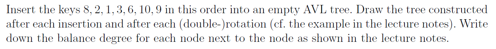
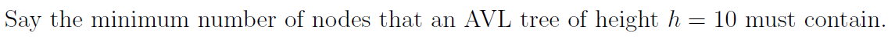
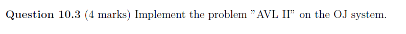

# Assignment X - DSAA(H)

**Name**: Yuxuan HOU (侯宇轩)

**Student ID**: 12413104

**Date**: 2025.11.17

## Question 10.1 (0.5 Marks)



Sol: 

```
8[0]
```

```
   8[+1]
  /
 2[0]
```

```
     8[+2]
    /
  2[+1]
 /
1[0]
```

```
   2[0]
  /   \
1[0]  8[0]
```

```
     2[-1]
    /     \
 1[0]    8[+1]
        /
      3[0]
```

```
        2[-2]
       /     \
    1[0]    8[+2]
           /
         3[-1]
           \
           6[0]
```

```
      2[-1]
     /     \
   1[0]   6[0]
         /   \
       3[0]  8[0]
```

```
        2[-2]
       /     \
    1[0]    6[-1]
           /    \
         3[0]   8[-1]
                  \
                  10[0]
```

```
        6[0]
      /     \
   2[0]     8[-1]
  /   \        \
1[0] 3[0]     10[0]
```

```
        6[-1]
      /      \
   2[0]      8[-2]
  /   \          \
1[0] 3[0]       10[+1]
                /
              9[0]
```

```
        6[0]
      /     \
   2[0]     9[0]
  /   \    /   \
1[0] 3[0] 8[0] 10[0]
```

## Question 10.2 (0.5 marks)



Sol:

Let $N(h)$ represents the answer with height $h$, we obtain the balance factor $\le 1$, thus to minimize the height, we have $N(h) = N(h - 1) + N(h - 2) + 1, N(0) = 1, N(1) = 2$. Via calculation, we have $N(10) = 232$.

## Question 10.3 (4 marks)



Sol:


```cpp
#define _USE_MATH_DEFINES
#include <bits/stdc++.h>

#define PI M_PI
#define E M_E

using namespace std;

mt19937 rnd(random_device{}());
int rndd(int l, int r){return rnd() % (r - l + 1) + l;}

using ll = long long;
using unll = unsigned long long;
using uint = uint;
using ld = long double;

template < typename T = int >
inline T read(void){
    T ret(0);
    short flag(1);
    char c = getchar();
    while(c != '-' && !isdigit(c))c = getchar();
    if(c == '-')flag = -1, c = getchar();
    while(isdigit(c)){
        ret *= 10;
        ret += int(c - '0');
        c = getchar();
    }
    ret *= flag;
    return ret;
}

class Node{
public:
    Node *ls, *rs;
    int val, siz, cnt, h;
};

Node *root;

#define siz(p) ((p) ? (p)->siz : 0)
#define height(p) ((p) ? (p)->h : 0)

class Tree{
private:
public:
    void Pushup(Node *p){
        if(!p)return;
        p->siz = siz(p->ls) + siz(p->rs) + p->cnt;
        p->h = max(height(p->ls), height(p->rs)) + 1;
    }
    int GetBalance(Node *p){
        if(!p)return 0;
        return height(p->ls) - height(p->rs);
    }
    Node* RotateRight(Node *y){
        Node *x = y->ls;
        Node *T2 = x->rs;
        x->rs = y, y->ls = T2;
        Pushup(y), Pushup(x);
        return x;
    }
    Node* RotateLeft(Node *x){
        Node *y = x->rs;
        Node *T2 = y->ls;
        y->ls = x, x->rs = T2;
        Pushup(x), Pushup(y);
        return y;
    }
    Node* QueryMx(Node *p = root){
        if(!p)return p;
        while(p->rs)p = p->rs;
        return p;
    }
    Node* QueryMn(Node *p = root){
        if(!p)return p;
        while(p->ls)p = p->ls;
        return p;
    }
    Node* Insert(int val, Node *p = root){
        if(!p)return new Node{nullptr, nullptr, val, 1, 1, 1};
        if(val < p->val)p->ls = Insert(val, p->ls);
        else if(val > p->val)p->rs = Insert(val, p->rs);
        else{
            ++p->cnt;
            Pushup(p);
            return p;
        }
        Pushup(p);
        int bf = GetBalance(p);
        if(bf > 1 && val < p->ls->val)return RotateRight(p);
        if(bf < -1 && val > p->rs->val)return RotateLeft(p);
        if(bf > 1 && val > p->ls->val)p->ls = RotateLeft(p->ls), p = RotateRight(p);
        else if(bf < -1 && val < p->rs->val)p->rs = RotateRight(p->rs), p = RotateLeft(p);
        return p;
    }
    Node* Delete(int val, Node *p = root){
        if(!p)return p;
        if(val < p->val)p->ls = Delete(val, p->ls);
        else if(val > p->val)p->rs = Delete(val, p->rs);
        else{
            if(p->cnt > 1)--p->cnt;
            else if(!p->ls || !p->rs){
                Node *tmp = p->ls ? p->ls : p->rs;
                if(!tmp){
                    delete p;
                    return nullptr;
                }else delete exchange(p, tmp);
            }else{
                Node *succ = QueryMn(p->rs);
                p->val = succ->val, p->cnt = succ->cnt;
                succ->cnt = 1;
                p->rs = Delete(succ->val, p->rs);
            }
        }
        if(!p)return p;
        Pushup(p);
        int bf = GetBalance(p);
        if(bf > 1){
            if(GetBalance(p->ls) >= 0)return RotateRight(p);
            p->ls = RotateLeft(p->ls);
            return RotateRight(p);
        }
        if(bf < -1){
            if(GetBalance(p->rs) <= 0)return RotateLeft(p);
            p->rs = RotateRight(p->rs);
            return RotateLeft(p);
        }
        return p;
    }
    int QueryRnk(int val, Node *p = root){
        if(!p)return 0;
        if(val == p->val)return siz(p->ls);
        if(val < p->val)return QueryRnk(val, p->ls);
        return siz(p->ls) + p->cnt + QueryRnk(val, p->rs);
    }
    Node* QueryByRnk(int rnk, Node *p = root){
        if(!p)return p;
        if(rnk <= siz(p->ls))return QueryByRnk(rnk, p->ls);
        if(rnk <= siz(p->ls) + p->cnt)return p;
        return QueryByRnk(rnk - siz(p->ls) - p->cnt, p->rs);
    }
    Node* QuerySuc(int val, Node *p = root){
        if(!p)return p;
        if(val >= p->val)return QuerySuc(val, p->rs);
        Node *res = QuerySuc(val, p->ls);
        return res ? res : p;
    }
    Node* QueryPre(int val, Node *p = root){
        if(!p)return p;
        if(val <= p->val)return QueryPre(val, p->ls);
        Node *res = QueryPre(val, p->rs);
        return res ? res : p;
    }
    void DfsPre(Node *p, uint &idx, uint &ans){
        if(!p)return;
        ans += idx++ ^ (uint)abs(p->val);
        DfsPre(p->ls, idx, ans);
        DfsPre(p->rs, idx, ans);
    }
}tr;

int main(){
    int T = read();
    while(T--){
        int opt = read(), val = read();
        switch(opt){
            case 1: root = tr.Insert(val); break;
            case 2: root = tr.Delete(val); break;
            case 3: printf("%d\n", tr.QueryRnk(val) + 1); break;
            case 4: printf("%d\n", tr.QueryByRnk(val)->val); break;
            case 5: printf("%d\n", tr.QueryPre(val)->val); break;
            case 6: printf("%d\n", tr.QuerySuc(val)->val); break;
        }
    }
    uint idx = 1, ans = 0;
    tr.DfsPre(root, idx, ans);
    printf("%u\n", ans);

    // fprintf(stderr, "Time: %.6lf\n", (double)clock() / CLOCKS_PER_SEC);
    return 0;
}
```
