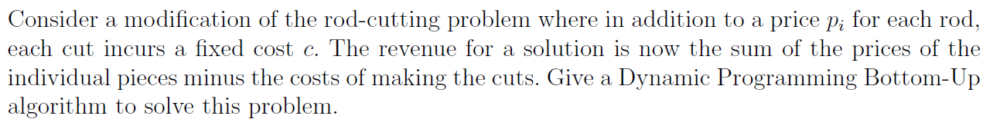
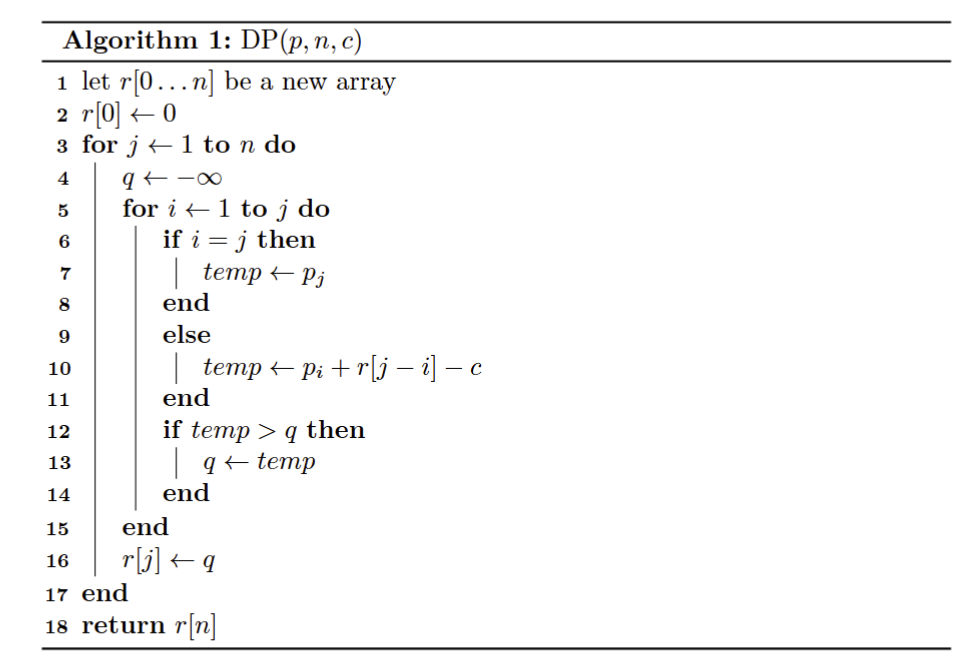
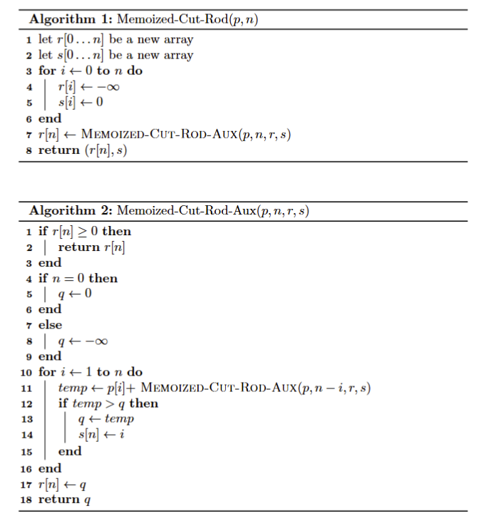
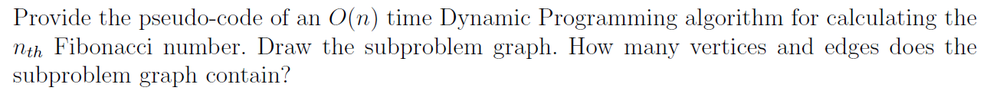
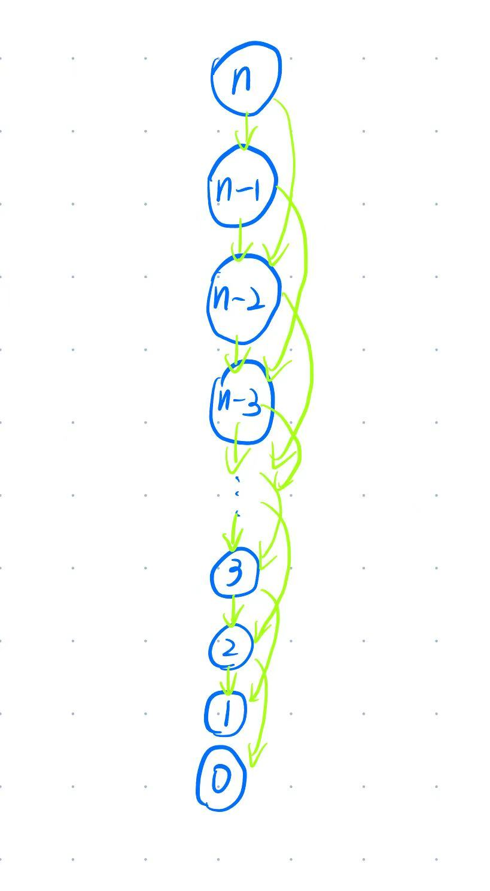
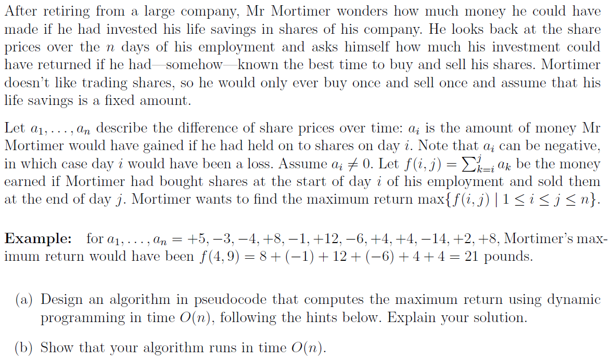
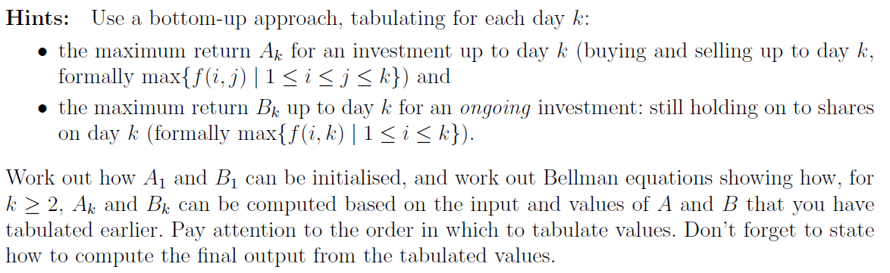
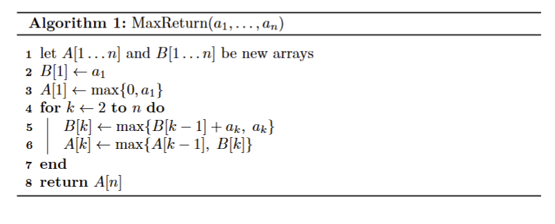
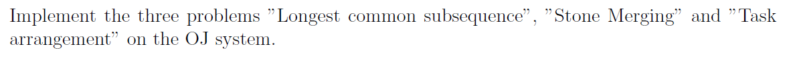

# Assignment XI - DSAA(H)

**Name**: Yuxuan HOU (侯宇轩)

**Student ID**: 12413104

**Date**: 2025.11.23

## Question 11.1 (0.25 marks)



Sol: 

Let $R(n)$ represents the answer with length $n$, then with cut of length $i$, we have $R(n) = p_i + R(n-i) - c$.

Therefore:
$$
R(n)
= \max\Bigl(
    p_n,\;
    \max_{1 \le i < n} \bigl\{ p_i + R(n-i) - c \bigr\}
  \Bigr)
$$
Pseudo Code:



## Question 11.2 (0.25 marks)


Sol:



## Question 11.3 (0.25 marks)



Sol:




Thus we obtain that the number of nodes: $\abs{V} = n + 1$, edges: $\abs{E} = (n - 1) \times 2 = 2n - 2$.

## Question 11.4 (1 mark)





Sol:

1. 



As the pseudo code goes, $B[i]$ represents the best interval ends with $i$, whose two options are connect with $B[i - 1]$ or start with new one. Then the maximum of $B[i]$, which is $A[n]$ will be the eventual answer.

2. As the pseudo code goes, there only contains a for-loop which is obviously linear and some $\Theta(1)$ operations. Therefore, the runtime is $\Theta(n)$, then it must be $O(n)$.

### Initialization

On day 1, the $B[1]$ must contains $a_1$, thus $B[1] = a_1$. For $A[1]$, it could be $B[1]$ or nothing, which is $\max\{ B[1], \  0 \}$.

### Bellman Equations

1. **Ongoing $$B_k$$**

    At day $$k$$ we either extend the best interval ending at day $$k-1$$, or start a new interval on day $$k$$.

    Thus, 
    $$
    B_k = \max\{B_{k-1} + a_k, \  a_k\}
    $$

2. **Finished $$A_k$$**

    By day $$k$$ we either already had the best finished investment on or before day $$k-1$$, or finish an ongoing investment at day $$k$$, which gives value $$B_k$$.

    Thus,
    $$
    A_k = \max\{A_{k-1},\ B_k\}
    $$

### Final Output

After computing up to day $$n$$, the maximum return overall is $$A_n$$.

## Question 11.5 (0.5 marks)



Sol:


```cpp
int main(){
    string s, t; cin >> s >> t;

    int N((int)s.size()), M((int)t.size());

    vector < vector < int > > dp(N + 10, vector < int >(M + 10, 0));

    for(int i = 1; i <= N; ++i){
        for(int j = 1; j <= M; ++j){
            if(s[i - 1] == t[j - 1])dp[i][j] = dp[i - 1][j - 1] + 1;
            else dp[i][j] = max(dp[i - 1][j], dp[i][j - 1]);
        }
    }

    int i(N), j(M);
    string ans;
    while(i > 0 && j > 0){
        if(s[i - 1] == t[j - 1])ans.push_back(s[i - 1]), --i, --j;
        else if(dp[i - 1][j] >= dp[i][j - 1])--i;
        else --j;
    }
    reverse(ans.begin(), ans.end());
    cout << ans << '\n';

    // fprintf(stderr, "Time: %.6lf\n", (double)clock() / CLOCKS_PER_SEC);
    return 0;
}
```

```cpp
int main(){
    int N = read(), M1 = read(), M2 = read();
    vector < int > D1(N + 10, 0), D2(N + 10, 0);
    vector < pair < int, int > > air1, air2;
    for(int i = 1; i <= M1; ++i){
        int s = read(), t = read();
        air1.push_back({s, t});
    }
    for(int i = 1; i <= M2; ++i){
        int s = read(), t = read();
        air2.push_back({s, t});
    }
    sort(air1.begin(), air1.end(), [](const pair < int, int > &a, const pair < int, int > &b)->bool{
        return a.first == b.first ? a.second < b.second : a.first < b.first;
    });
    sort(air2.begin(), air2.end(), [](const pair < int, int > &a, const pair < int, int > &b)->bool{
        return a.first == b.first ? a.second < b.second : a.first < b.first;
    });
    auto cmp = [](const pair < int, int > &a, const pair < int, int > &b)->bool{
        return a.first == b.first ? a.second > b.second : a.first > b.first;
    };
    priority_queue < pair < int, int >, vector < pair < int, int > >, decltype(cmp) > cur(cmp);
    priority_queue < int, vector < int >, greater < int > > fre;
    int lft(0);
    for(auto [s, t] : air1){
        while(!cur.empty() && cur.top().first < s)
            fre.push(cur.top().second), cur.pop();
        int idx(-1);
        if(!fre.empty())idx = fre.top(), fre.pop();
        else idx = ++lft;
        if(idx <= N)++D1[idx];
        cur.push({t, idx});
    }
    while(!cur.empty())cur.pop();
    while(!fre.empty())fre.pop();
    lft = 0;
    for(auto [s, t] : air2){
        while(!cur.empty() && cur.top().first < s)
            fre.push(cur.top().second), cur.pop();
        int idx(-1);
        if(!fre.empty())idx = fre.top(), fre.pop();
        else idx = ++lft;
        if(idx <= N)++D2[idx];
        cur.push({t, idx});
    }

    int res(0);
    for(int i = 1; i <= N; ++i)D1[i] += D1[i - 1], D2[i] += D2[i - 1];
    for(int i = 0; i <= N; ++i)res = max(res, D1[i] + D2[N - i]);
    printf("%d\n", res);
    

    // fprintf(stderr, "Time: %.6lf\n", (double)clock() / CLOCKS_PER_SEC);
    return 0;
}
```

```cpp
int main(){
    int N = read();
    vector < ll > A((N << 1) + 10, 0);
    for(int i = 1; i <= N; ++i)A[i] = A[i + N] = read();

    vector < ll > pre((N << 1) + 10, 0);
    for(int i = 1; i <= N << 1; ++i)pre[i] = pre[i - 1] + A[i];

    const ll INF = LONG_LONG_MAX >> 2;

    vector < vector < ll > > dpMn(410, vector < ll >(410)), dpMx(410, vector < ll >(410));

    for(int len = 2; len <= N; ++len){
        for(int i = 1; i + len - 1 <= N << 1; ++i){
            int j = i + len - 1;
            dpMn[i][j] = INF;
            dpMx[i][j] = 0;
            ll w(pre[j] - pre[i - 1]);
            for(int k = i; k < j; ++k)
                dpMn[i][j] = min(dpMn[i][k] + dpMn[k + 1][j] + w, dpMn[i][j]),
                dpMx[i][j] = max(dpMx[i][k] + dpMx[k + 1][j] + w, dpMx[i][j]);
        }
    }

    ll ansMn(INF), ansMx(0);
    for(int i = 1; i <= N; ++i)
        ansMn = min(ansMn, dpMn[i][i + N - 1]),
        ansMx = max(ansMx, dpMx[i][i + N - 1]);

    printf("%lld\n%lld\n", ansMn, ansMx);

    // fprintf(stderr, "Time: %.6lf\n", (double)clock() / CLOCKS_PER_SEC);
    return 0;
}

```

```cpp
int main(){
    int N = read();
    ll s = read < ll >();

    vector < ll > sumT(N + 10, 0);
    vector < ll > sumC(N + 10, 0);

    for(int i = 1; i <= N; ++i){
        int t = read(), c = read();
        sumT[i] = sumT[i - 1] + (ll)t;
        sumC[i] = sumC[i - 1] + (ll)c;
    }

    const ll INF(0x3f3f3f3f3f3f3f3fLL);
    vector < ll > dp(N + 10, 0);
    for(int i = 1; i <= N; ++i)dp[i] = INF;
    dp[0] = 0;

    ll totC(sumC[N]);

    for(int i = 1; i <= N; ++i){
        ll curT(sumT[i]);
        ll curC(sumC[i]);
        for(int j = 0; j < i; ++j)
            dp[i] = min(dp[i], dp[j] + curT * (curC - sumC[j]) + s * (totC - sumC[j]));
    }

    printf("%lld\n", dp[N]);

    // fprintf(stderr, "Time: %.6lf\n", (double)clock() / CLOCKS_PER_SEC);
    return 0;
}

```

