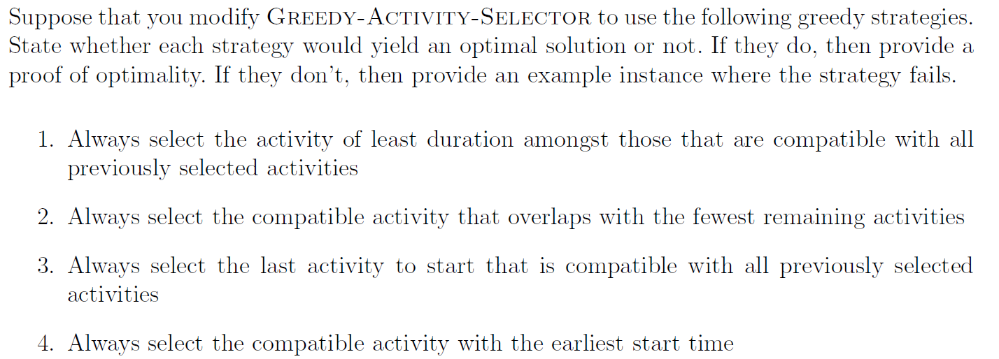
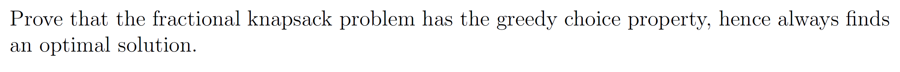
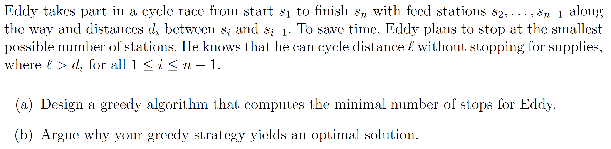
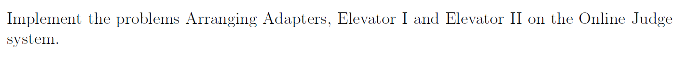

# Assignment XII - DSAA(H)

**Name**: Yuxuan HOU (侯宇轩)

**Student ID**: 12413104

**Date**: 2025.12.01

## Question 12.1 (0.5 marks)



Sol: 

1. This strategy is **not** always optimal. 

   Counterexample: activities with intervals 

   $$a_1=(1,9),\quad a_2=(8,11),\quad a_3=(10,20).$$ 

   Durations are $8$, $3$, and $10$, so the greedy rule chooses $a_2$ first. 

   Activity $a_2$ overlaps both $a_1$ and $a_3$, so no other activity can then be chosen, giving a schedule of size $1$. 

   However, the optimal solution selects $\{a_1,a_3\}$ with $2$ activities.

2. This strategy is **not** always optimal. 

   Consider 11 activities with start times 

   $$s=(0,1,1,1,2,3,4,5,5,5,6)$$ and finish times $$f=(2,3,3,3,4,5,6,7,7,7,8).$$ 

   The numbers of other activities each overlaps are $$3,4,4,4,4,2,4,4,4,4,3$$.

   The greedy rule first selects $a_6=(3,5)$, which overlaps only $2$ other activities. 

   After this choice, at most two further activities can be added, so the schedule has size at most $3$. 

   An optimal schedule is $\{a_1,a_5,a_7,a_{11}\}$, containing $4$ compatible activities.

3. This strategy **does** always optimal. 

   For each activity $i$ with interval $[s_i,f_i]$, define a reversed-time interval $[s'_i,f'_i]=(-f_i,-s_i]$. 

   In reversed time, choosing the activity that starts last in the original corresponds to choosing the activity that finishes earliest. 

   The standard greedy algorithm that repeatedly selects the earliest finishing compatible activity is known to be optimal. 

   Therefore, choosing the last-starting compatible activity in the original timeline is equivalent to running the earliest-finish-time algorithm on reversed time, and 

   so it is also optimal.

4. This strategy is **not** always optimal. 

   Counterexample: activities $$a_1=(1,10),\quad a_2=(2,3),\quad a_3=(4,5).$$ 

   The greedy rule picks $a_1$ first because it has the earliest start time. 

   Activity $a_1$ overlaps both $a_2$ and $a_3$, so no other activity can be added, yielding a schedule of size $1$. 

   However, $a_2$ and $a_3$ are compatible, so the optimal solution chooses $\{a_2,a_3\}$ with $2$ activities.

## Question 12.2 (0.25 marks)



PF:

Sort items by value density $$\rho_i = v_i / w_i$$ so that $$\rho_1 \ge \rho_2 \ge \dots \ge \rho_n.$$

Greedy choice for the first item: For any optimal solution., if it already uses item 1 as much as possible, it satisfy.

Otherwise, it uses some weight of other items $$j$$ with $$\rho_j \le \rho_1$$ and less than the maximum possible weight of item 1. 

Move a small weight $$\delta$$ from such an item $$j$$ to item 1, the value change is $$\delta(\rho_1 - \rho_j) \ge 0,$$ so the solution won't be worse.

Repeating, we obtain an optimal solution that uses item 1 as much as capacity allows. Hence the greedy first choice is part of some optimal solution.

After fixing item 1 greedily, the remaining capacity and remaining items form a smaller fractional-knapsack instance.  

By the same argument, taking as much as possible of the next highest-density item is part of some optimal solution of the subproblem, and so on.

By induction, repeatedly taking as much as possible of the remaining item with largest value density yields an optimal solution.  

Therefore the fractional knapsack problem has the greedy-choice property, and the greedy algorithm is optimal.

## Question 12.3 (0.5 marks)



Sol:

1. From the current station, always ride to the farthest station that is within distance $\ell$, stop there and repeat until reaching $s_n$.

We can implement this by scanning the stations once from left to right, so the running time is $O(n)$.

2. Let the greedy algorithm choose $g_1$ as its first stop, i.e. the farthest station reachable from $s_1$ within distance $\ell$.

Take any optimal solution and let its first stop be $o_1$. Since $o_1$ is reachable from $s_1$ within $\ell$, and $g_1$ is the farthest such station, $g_1$ lies at least as far along the route as $o_1$.

Replace $o_1$ by $g_1$ in this optimal solution and keep all later stops unchanged.  The new schedule is still feasible and uses no more stops.

Hence there exists an optimal solution whose first stop is exactly the greedy choice $g_1$.

After stopping at $g_1$, the remaining problem (from $g_1$ to $s_n$) has the same structure. 

Repeating the same argument inductively shows that every greedy choice can be aligned with some optimal solution, so the greedy algorithm produces a schedule with the minimal possible number of stops.

## Question 12.4 (0.75 marks)



Sol:


```cpp
int main(){
    int N = read();
    ll S = read < ll >();
    vector < ll > W(N);
    for(int i = 0; i < N; ++i)W[i] = read < ll >();

    if(S == 1){printf("%d\n", N >= 1 ? 1 : 0); return 0;}

    if(S >= 2 && N <= 2){printf("%d\n", N); return 0;}

    sort(W.begin(), W.end());

    ll num(0), cnt1(0), cnt2(0);
    int used(0);

    for(int i = 0; i < N - 2; ++i){
        ll len = W[i];
        ll x = len / 3;
        int r = len % 3;
        if(r == 1)++cnt1;
        if(r == 2)++cnt2;
        ll pairCnt = cnt1 < cnt2 ? cnt1 : cnt2;
        x += pairCnt;
        cnt1 -= pairCnt;
        cnt2 -= pairCnt;
        ll need = num + x + (cnt1 + 1) / 2 + cnt2;
        if(need > S - 2)break;
        num += x;
        ++used;
    }

    int ans = used + 2;
    if(ans > N)ans = N;
    printf("%d\n", ans);

    // fprintf(stderr, "Time: %.6lf\n", (double)clock() / CLOCKS_PER_SEC);
    return 0;
}
```

```cpp
int main(){
    int T = read();

    while(T--){
        int N = read();
        ll K = read < ll >();

        vector < int > C(N + 1), W(N + 1), F(N + 1);
        int mxFloor(0);
        for(int i = 1; i <= N; ++i){
            C[i] = read(), W[i] = read(), F[i] = read();
            mxFloor = max(mxFloor, F[i]);
        }

        vector < ll > cnt1(mxFloor + 1, 0), cnt2(mxFloor + 1, 0);
        for(int i = 1; i <= N; ++i){
            if(W[i] == 1)cnt1[F[i]] += (ll)C[i];
            else cnt2[F[i]] += (ll)C[i];
        }

        auto CalcRides = [&](ll X, ll Y)->ll{
            if(X == 0 && Y == 0)return 0;
            ll halfK = K >> 1, pairs = X >> 1;
            ll A = Y + pairs;
            if(A == 0)return (X & 1) ? 1 : 0;
            ll bins = (A + halfK - 1) / halfK;
            if((X & 1) && A % halfK == 0)++bins;
            return bins;
        };

        ll tot1(0), tot2(0);
        ll ans(0);

        for(int f = mxFloor; f >= 1; --f){
            tot1 += cnt1[f], tot2 += cnt2[f];
            ll rides = CalcRides(tot1, tot2);
            ans += rides;
        }

        printf("%lld\n", ans);
    }

    // fprintf(stderr, "Time: %.6lf\n", (double)clock() / CLOCKS_PER_SEC);
    return 0;
}

```

```cpp
struct Person{
    ll l, r;
    int id;
};

int main(){
    int T = read();
    while(T--){
        int N = read();
        ll F = read();

        vector < Person > P(N);
        for(int i = 0; i < N; ++i){
            ll L = read();
            ll R = read();
            P[i].l = L, P[i].r = R;
            P[i].id = i + 1;
        }

        vector < char > used(N + 10, 0);

        sort(P.begin(), P.end(), [](const Person &a, const Person &b)->bool{
            if(a.l == b.l)return a.r > b.r;
            return a.l < b.l;
        });

        ll now(F), ans(0);
        vector < int > order;

        for(int i = 0; i < N; ++i){
            ll L = P[i].l, R = P[i].r;
            if(L <= now){
                if(R > now){
                    ans += (R - L);
                    now = R;
                    used[P[i].id] = 1;
                    order.push_back(P[i].id);
                }
            }else{
                ans += (L - now);
                ans += (R - L);
                now = R;
                used[P[i].id] = 1;
                order.push_back(P[i].id);
            }
        }

        sort(P.begin(), P.end(), [](const Person &a, const Person &b)->bool{
            return a.r > b.r;
        });

        for(int i = 0; i < N; ++i){
            if(used[P[i].id])continue;
            ll L = P[i].l;
            ll R = P[i].r;
            ans += (R - L);
            order.push_back(P[i].id);
        }

        printf("%lld\n", ans);
        for(int i = 0; i < N; ++i)
            printf("%d%c", order[i], i + 1 == N ? '\n' : ' ');
    }

    return 0;
}

```

