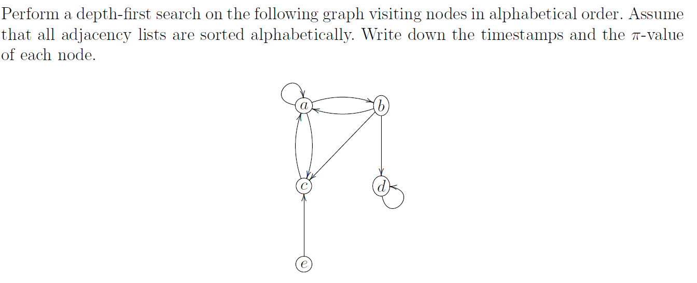
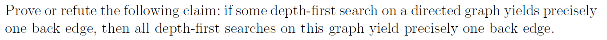
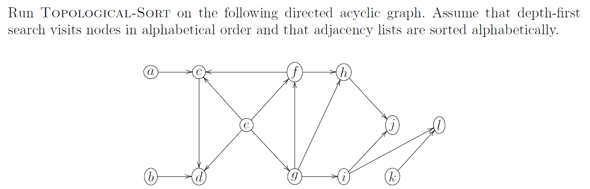
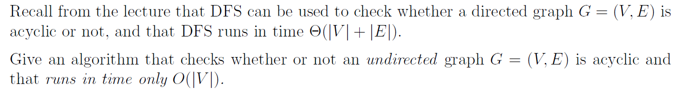
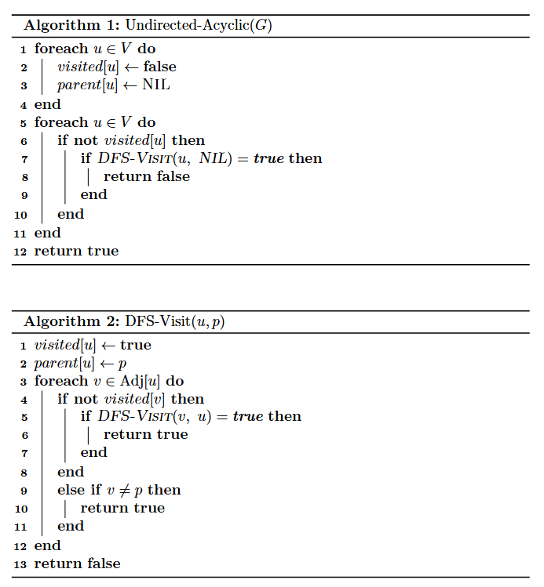
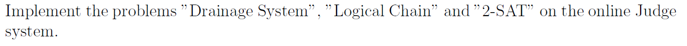

# Assignment XIV - DSAA(H)

**Name**: Yuxuan HOU (侯宇轩)

**Student ID**: 12413104

**Date**: 2025.12.16

## Question 14.1 (0.25 marks)



Sol:
1. The traversal $a \to b \to c$ (finish $c$) $\to d$ (finish $d$) (finish $b$) (finish $a$), then $e$ (finish $e$).
---
2. The timestamps and parents are: $a:(d=1,f=8,\pi=\text{NIL})$, $b:(d=2,f=7,\pi=a)$, $c:(d=3,f=4,\pi=b)$, $d:(d=5,f=6,\pi=b)$, $e:(d=9,f=10,\pi=\text{NIL})$.

## Question 14.2 (0.5 marks)



PF:
The claim is **false**.

Counterexample: Consider the directed graph with $V=\{1,2,3\}$ and $E=\{(1,2),(2,3),(3,1),(3,2)\}$. An edge $(u,v)$ is a back edge iff $v$ is an ancestor of $u$ in the DFS tree.

Run DFS with vertex order $1,2,3$. The DFS tree can be $1\to 2\to 3$, and from $3$ both edges $(3,1)$ and $(3,2)$ go to gray ancestors, so there are $2$ back edges.

Then run DFS with vertex order $3,1,2$ (start at $3$). One possible DFS tree is $3\to 1\to 2$, so $(2,3)$ is a back edge, and when $(3,2)$ is examined, $2$ is already black, so it is not a back edge.

Hence one DFS has exactly $1$ back edge while another has $2$, refuting the claim.
$\texttt{Q.E.D.}$


## Question 14.3 (0.25 marks)



Sol:
Using Topological-Sort, the finish times are $f[k]=24,f[e]=22,f[g]=21,f[i]=20,f[l]=19,f[f]=15,f[h]=14,f[j]=13,f[b]=8,f[a]=6,f[c]=5,f[d]=4$.
Hence the topological ordering is $$k,\ e,\ g,\ i,\ l,\ f,\ h,\ j,\ b,\ a,\ c,\ d.$$

## Question 14.4 (0.5 marks)



Sol:
Run DFS on the undirected graph while storing $parent[u]$.

In DFS-Visit$(u,p)$, mark $u$ visited and scan each neighbor $v\in Adj[u]$: if $v$ is unvisited, set $parent[v]=u$ and recurse; otherwise, if $v\ne p$, report “cyclic”. If all DFS trees finish without triggering $v\ne p$, report “acyclic”.
The DFS work is $O(|V|+|E|)$, and for an undirected acyclic graph (a forest) we have $|E|\le |V|-1$, so the full check runs in $O(|V|)$.



## Question 14.5 (1 mark)



Sol:


```cpp
struct Fraction{//non-negative
    __int128_t a, b;
    Fraction Shrink(void){
        __int128_t div = __gcd(a, b);
        a /= div, b /= div;
        return *this;
    }
    friend const Fraction operator + (const Fraction &x, const Fraction &y){
        __int128_t below = x.b * y.b / __gcd(x.b, y.b);
        return Fraction{below / x.b * x.a + below / y.b * y.a, below}.Shrink();
    }
    friend const Fraction operator / (const Fraction &x, const int &v){
        return Fraction{x.a, x.b * v}.Shrink();
    }
    friend const Fraction operator / (const Fraction &x, const Fraction &y){
        return Fraction{x.a * y.b, x.b * y.a}.Shrink();
    }
    friend const Fraction operator * (const Fraction &x, const Fraction &y){
        return Fraction{x.a * y.a, x.b * y.b}.Shrink();
    }
    friend const bool operator <= (const Fraction &x, const Fraction &y){
        return x.a * y.b <= y.a * x.b;
    }
    friend const bool operator >= (const Fraction &x, const Fraction &y){
        return x.a * y.b > y.a * x.b;
    }
    friend const bool operator < (const Fraction &x, const Fraction &y){
        return x.a * y.b < y.a * x.b;
    }
    friend const bool operator > (const Fraction &x, const Fraction &y){
        return x.a * y.b > y.a * x.b;
    }
    void Desc(void){
        this->Shrink();
        printf("%lld/%lld\n", (ll)this->a, (ll)this->b);
    }
};


void print(__int128_t x) {
    if(x > 9)print(x / 10);
    putchar(x % 10 + '0');
}

int main(){
    int N = read(), M = read();
    vector < vector<int> > adj(N + 10);
    vector < int > d(N + 10, 0);
    vector < int > inDeg(N + 10, 0);
    vector < Fraction > water(N + 10, {0, 1});
    
    for(int i = 1; i <= N; ++i){
        d[i] = read();
        if(d[i] == 0)continue;
        for(int j = 1; j <= d[i]; ++j){
            int to = read();
            adj[i].push_back(to);
            ++inDeg[to];
        }
    }
    
    queue < int > Q;
    for(int i = 1; i <= M; ++i){
        water[i] = {1, 1};
        if(inDeg[i] == 0)Q.push(i);
    }
    while(!Q.empty()){
        int u = Q.front();
        Q.pop();
        if(d[u] == 0)continue;
        Fraction flowOut = water[u] / d[u];
        for(int v : adj[u]){
            water[v] = water[v] + flowOut;
            --inDeg[v];
            if(inDeg[v] == 0)Q.push(v);
        }
    }
    for(int i = 1; i <= N; ++i){
        if(d[i] == 0){
            if(water[i].a == 0)printf("0 1\n");
            else {
                print(water[i].a); putchar(' ');
                print(water[i].b); putchar('\n');
            }
        }
    }
    return 0;
}

```

```cpp
int main(){
    int N = read(), M = read();

    vector < bitset < 260 > > adj(N + 10), rev(N + 10);

    for(int i = 0; i < N; ++i){
        char c = getchar();
        while(!isdigit(c))c = getchar();
        if(c - '0')adj[i][0] = 1, rev[0][i] = 1;
        for(int j = 1; j < N; ++j){
            c = getchar();
            if(c - '0')adj[i][j] = 1, rev[j][i] = 1;
        }
    }

    bitset < 260 > vis;
    vector < int > ord;
    int cnt(0);

    auto dfs1 = [&](auto &&self, int p)->void{
        vis[p] = 1;
        while(true){
            int q = (adj[p] & ~vis)._Find_first();
            if(q >= N)break;
            self(self, q);
        }
        ord.push_back(p);
    };

    auto dfs2 = [&](auto &&self, int p)->void{
        vis[p] = 1;
        ++cnt;
        while(true){
            int q = (rev[p] & ~vis)._Find_first();
            if(q >= N)break;
            self(self, q);
        }
    };

    for(int i = 1; i <= M; ++i){
        int K = read();
        while(K--){
            int p(read() - 1), q(read() - 1);
            adj[p].flip(q), rev[q].flip(p);
        }

        vis.reset();
        ord.clear();
        for(int p = 0; p < N; ++p)
            if(!vis[p])dfs1(dfs1, p);

        vis.reset();
        ll ans(0);
        for(int j = N - 1; j >= 0; --j){
            int p(ord[j]);
            if(!vis[p]){
                cnt = 0;
                dfs2(dfs2, p);
                ans += (1ll * cnt * (cnt - 1)) >> 1;
            }
        }
        printf("%lld\n", ans);
    }

    // fprintf(stderr, "Time: %.6lf\n", (double)clock() / CLOCKS_PER_SEC);
    return 0;
}

```

```cpp
struct Edge{
    Edge* nxt;
    int to;
};

int main(){
    int N(0), M(0);

    bool bol(true);
    int ch(0);
    while((ch = getchar()) != EOF){
        if(bol && ch == 'c'){
            while(ch != '\n' && ch != EOF)ch = getchar();
            bol = true;
            continue;
        }
        if(bol && ch == 'p')break;
        bol = (ch == '\n');
    }

    N = read(), M = read();
    int V(N << 1);

    vector < Edge* > head(V + 10, nullptr), rHead(V + 10, nullptr);
    vector < Edge > ed((M << 1) + 10), red((M << 1) + 10);
    int ec(0), rc(0);

    auto Id = [&](int lit)->int{
        int p((abs(lit) - 1) << 1);
        if(lit < 0)p ^= 1;
        return p;
    };

    auto AddEdge = [&](int s, int t)->void{
        ed[ec] = Edge{head[s], t}, head[s] = &ed[ec++];
        red[rc] = Edge{rHead[t], s}, rHead[t] = &red[rc++];
    };

    auto AddClause = [&](int a, int b)->void{
        int p(Id(a)), q(Id(b));
        AddEdge(p ^ 1, q), AddEdge(q ^ 1, p);
    };

    for(int i = 1; i <= M; ++i){
        int a = read(), b = read();
        int z = read();
        while(z != 0)z = read();
        AddClause(a, b);
    }

    vector < char > vis(V + 10, 0);
    vector < Edge* > it(V + 10, nullptr);
    vector < int > ord, stk;

    for(int p = 0; p < V; ++p){
        if(vis[p])continue;

        stk.clear();
        stk.push_back(p);
        vis[p] = 1, it[p] = head[p];

        while((int)stk.size()){
            int u(stk.back());
            auto &e = it[u];

            while(e && vis[e->to])e = e->nxt;

            if(!e){
                ord.push_back(u);
                stk.pop_back();
            }else{
                int v(e->to);
                e = e->nxt;
                if(!vis[v])vis[v] = 1, it[v] = head[v], stk.push_back(v);
            }
        }
    }

    for(int p = 0; p < V; ++p)vis[p] = 0;

    vector < int > comp(V + 10, -1);
    int scc(0);

    for(int idx = (int)ord.size() - 1; idx >= 0; --idx){
        int p(ord[idx]);
        if(vis[p])continue;

        stk.clear();
        stk.push_back(p);
        vis[p] = 1, comp[p] = scc;

        while((int)stk.size()){
            int u(stk.back());
            stk.pop_back();
            for(auto i = rHead[u]; i; i = i->nxt)
                if(!vis[i->to])vis[i->to] = 1, comp[i->to] = scc, stk.push_back(i->to);
        }

        ++scc;
    }

    for(int i = 0; i < N; ++i){
        int p(i << 1);
        if(comp[p] == comp[p ^ 1]){
            printf("s UNSATISFIABLE\n");
            return 0;
        }
    }

    printf("s SATISFIABLE\n");
    printf("v ");
    for(int i = 0; i < N; ++i){
        int p(i << 1);
        int val = comp[p] > comp[p ^ 1] ? (i + 1) : -(i + 1);
        printf("%d ", val);
    }
    printf("0\n");

    return 0;
}

```


