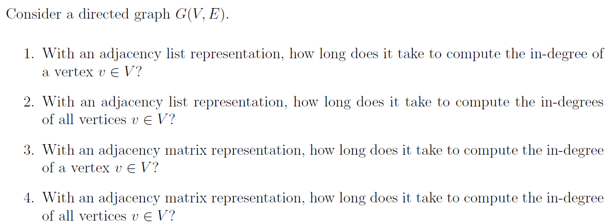
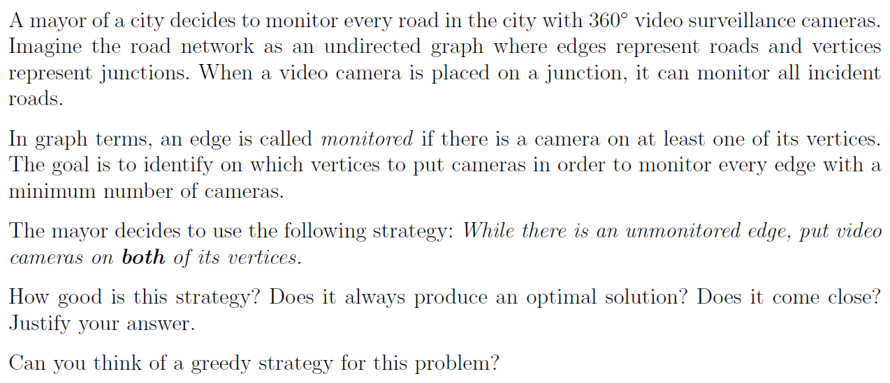
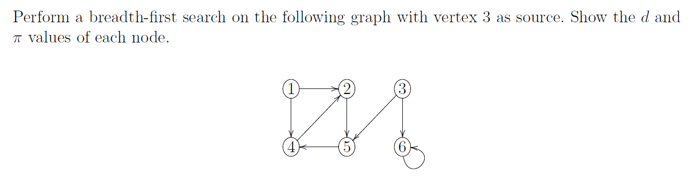
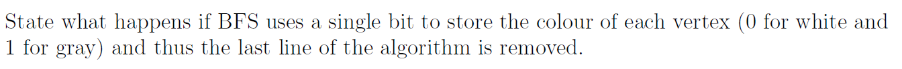
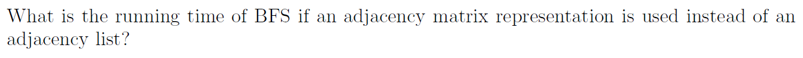
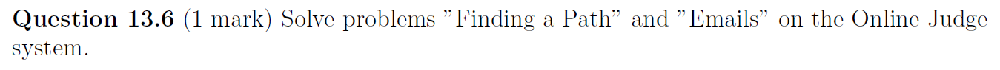

# Assignment XIV - DSAA(H)

**Name**: Yuxuan HOU (侯宇轩)

**Student ID**: 12413104

**Date**: 2025.12.11

## Question 13.1 (0.5 marks)



Sol:

1. With an adjacency list representation, to compute the in-degree of a vertex $v$ we must scan all adjacency lists and count how many times $v$ appears as a neighbor. The total length of all lists is $|E|$, so the running time is $\Theta(|V| + |E|)$.

---

2. With an adjacency list representation, to compute the in-degrees of all vertices we initialise an array $\text{indeg}[v]=0$ for all $v\in V$, then scan every adjacency list once and for each edge $(u,w)$ increment $\text{indeg}[w]$. This takes $\Theta(|V| + |E|)$ time.

---

3. With an adjacency matrix representation, the in-degree of a vertex $v$ is the number of ones in column $v$. We must scan all $|V|$ entries of that column, so the running time is $\Theta(|V|)$.

---

4. With an adjacency matrix representation, to compute the in-degrees of all vertices we need to examine all $|V|^2$ entries in the matrix (for example by scanning each column). The running time is $\Theta(|V|^2)$.

## Question 13.2 (0.5 marks)



Sol:

1. The problem is the minimum vertex cover problem on an undirected graph. 
   
   The mayor’s rule “while there is an unmonitored edge, put cameras on both endpoints” does **not** always give an optimal solution. 

   Example: on the path $1-2-3-4$, an optimal solution is $\{2,3\}$ (2 cameras). The mayor could first choose edge $(1,2)$, placing cameras on $1$ and $2$, and then choose edge $(3,4)$, placing cameras on $3$ and $4$, for a total of 4 cameras.
   
   Let $M$ be the set of edges chosen by the mayor. No two edges in $M$ share a vertex, because once a vertex gets a camera none of its incident edges will ever be chosen again, so $M$ is a matching. Any vertex cover $C^*$ must contain at least one endpoint of each edge in $M$, so $|C^*|\ge |M|$. The mayor’s camera set $C$ contains both endpoints of each edge in $M$, hence $|C| = 2|M| \le 2|C^*|$. Therefore the strategy is a $2$-approximation: it never uses more than twice as many cameras as an optimal solution, and this factor $2$ is tight.
   
   Therefore, the solution comes close and is nice.

---

2. A natural greedy strategy is to always place the next camera on the vertex that currently has the largest number of unmonitored incident edges. Concretely, maintain the set $C$ of vertices with cameras and the set $U$ of unmonitored edges. Initially $C = \varnothing$ and $U = E$. While $U$ is nonempty, for each vertex $v$ compute its current unmonitored degree $d_U(v)$, choose a vertex $v^*$ with maximum $d_U(v)$, put a camera on $v^*$, and delete from $U$ all edges incident to $v^*$. When $U$ becomes empty, return $C$ as the set of camera locations. Nevertheless, this greedy solution might be worse.


## Question 13.3 (0.25 marks)



Sol:

The BFS tree with source vertex $3$ gives the following distance $d$ and predecessor $\pi$ values:

- Vertex $1$: $d[1] = \infty$, $\pi[1] = \text{NIL}$.
- Vertex $2$: $d[2] = 3$, $\pi[2] = 4$.
- Vertex $3$: $d[3] = 0$, $\pi[3] = \text{NIL}$.
- Vertex $4$: $d[4] = 2$, $\pi[4] = 5$.
- Vertex $5$: $d[5] = 1$, $\pi[5] = 3$.
- Vertex $6$: $d[6] = 1$, $\pi[6] = 3$.

## Question 13.4 (0.25 marks)



Sol:

If BFS uses only one bit of colour (0 = white, 1 = gray) and the last line that sets a vertex to black is removed, the algorithm still produces the correct BFS tree and distances.

The only colour test in BFS is if v.colour == WHITE then enqueue v. Once a vertex has been discovered, its colour becomes nonwhite and is never changed back to white, so it will never be enqueued again. Thus each vertex is discovered and enqueued at most once, and the queue order is unchanged.

What we lose is only the distinction between vertices that are currently in the queue and vertices that have been fully processed. 

## Question 13.5 (0.25 marks)



Sol:

When BFS is implemented with an adjacency matrix, its running time is $\Theta(|V|^2)$.

Reason: For each vertex $u$ that is dequeued, BFS must scan the entire row of the matrix to find all neighbours of $u$. This takes $\Theta(|V|)$ time per vertex. Since there are $|V|$ vertices and each is processed once, the total time spent scanning adjacency information is $\Theta(|V| \cdot |V|) = \Theta(|V|^2)$. The initialization cost is dominated by $|V|^2$, so the overall running time is $\Theta(|V|^2)$.

## Question 13.6 (1 mark)



Sol:


```cpp
struct Edge{
    Edge* nxt;
    int to;
};

int main(){
    int N = read(), M = read();
    vector < Edge* > head(N + 1, nullptr), rhead(N + 1, nullptr);
    for(int i = 1; i <= M; ++i){
        int x = read(), y = read();
        head[x] = new Edge{head[x], y};
        rhead[y] = new Edge{rhead[y], x};
    }

    int s = read(), t = read();
    
    vector < int > vis(N + 1, 0);
    queue < int > q;

    vis[t] = 1;
    q.push(t);
    while(!q.empty()){
        int u = q.front(); q.pop();
        for(auto i = rhead[u]; i; i = i->nxt){
            if(!vis[i->to])vis[i->to] = 1, q.push(i->to);
        }
    }
    
    if(!vis[s]){printf("-1\n"); return 0;}
    
    vector < int > good(N + 1, 1);
    for(int p = 1; p <= N; ++p){
        for(auto i = head[p]; i; i = i->nxt){
            if(!vis[i->to]){good[p] = 0; break;}
        }
    }
    
    vector < int > ok(N + 1, 0);
    for(int p = 1; p <= N; ++p)
        if(good[p] && vis[p])ok[p] = 1;
    
    if(!ok[s] || !ok[t]){printf("-1\n"); return 0;}
    
    vector < int > dis(N + 1, -1);
    while(!q.empty())q.pop();
    dis[s] = 0;
    q.push(s);
    while(!q.empty()){
        int p = q.front(); q.pop();
        if(p == t)break;
        for(auto i = head[p]; i; i = i->nxt){
            if(!ok[i->to])continue;
            if(dis[i->to] != -1)continue;
            dis[i->to] = dis[p] + 1;
            q.push(i->to);
        }
    }
    
    printf("%d\n", dis[t]);
    // fprintf(stderr, "Time: %.6lf\n", (double)clock() / CLOCKS_PER_SEC);
    return 0;
}
```

```cpp
struct Edge{
    Edge* nxt;
    int to;
};

int main(){
    int N = read(), M = read();
    
    vector < Edge* > head(N + 1, nullptr);
    
    for(int k = 1; k <= M; ++k){
        int x = read(), y = read();
        head[x] = new Edge{head[x], y};
        head[y] = new Edge{head[y], x};
    }
    
    vector < int > dis1(N + 1, -1);
    queue < int > q;
    dis1[1] = 0;
    q.push(1);
    
    int farNode(1), farDist(0), cnt(0);
    
    while(!q.empty()){
        int p = q.front(); q.pop();
        ++cnt;
        if(dis1[p] > farDist)farDist = dis1[p], farNode = p;
        for(auto i = head[p]; i; i = i->nxt){
            int v = i->to;
            if(dis1[v] != -1)continue;
            dis1[v] = dis1[p] + 1;
            q.push(v);
        }
    }
    
    if(cnt < N){printf("-1\n"); return 0;}
    
    
    vector < int > dis2(N + 1, -1);
    queue < int > q2;
    dis2[farNode] = 0;
    q2.push(farNode);
    
    int dPrime(0);
    
    while(!q2.empty()){
        int p = q2.front(); q2.pop();
        if(dis2[p] > dPrime)dPrime = dis2[p];
        for(auto i = head[p]; i; i = i->nxt){
            int v = i->to;
            if(dis2[v] != -1)continue;
            dis2[v] = dis2[p] + 1;
            q2.push(v);
        }
    }
    
    int k(0), len(1);
    while(len < dPrime)len <<= 1, ++k;
    
    printf("%d\n", k + 1);
    
    // fprintf(stderr, "Time: %.6lf\n", (double)clock() / CLOCKS_PER_SEC);
    return 0;
}

```


