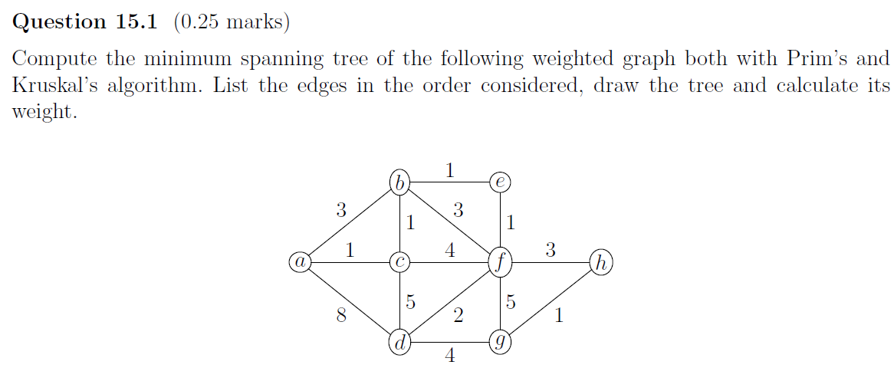
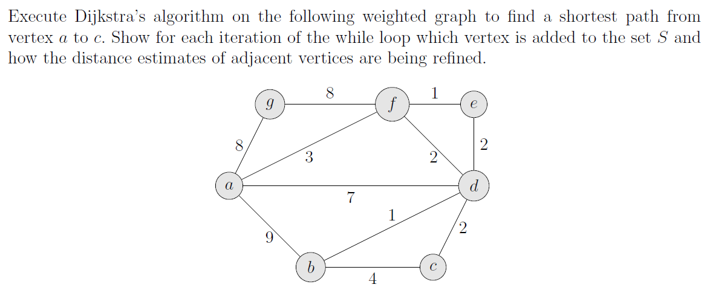
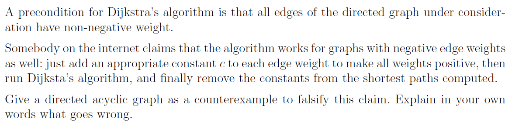
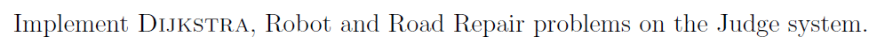

# Assignment XV - DSAA(H)

**Name**: Yuxuan HOU (侯宇轩)

**Student ID**: 12413104

**Date**: 2025.12.21

## Question 15.1 (0.25 marks)



Sol:
1. Prim (start at $a$)

   Selected edges (in order): $ac(1),cb(1),be(1),ef(1),fd(2),fh(3),hg(1)$.

   MST edges: $\{ac(1),cb(1),be(1),ef(1),fd(2),fh(3),hg(1)\}$.

   Total weight: $1+1+1+1+2+3+1=10$.

   Sketch (connectivity): $a-c-b-e-f-h-g$ and $f-d$.

---
2. Kruskal (ties broken lexicographically)

   Edges considered (take/skip):
   $ac(1)$ take;
   $bc(1)$ take;
   $be(1)$ take;
   $ef(1)$ take;
   $gh(1)$ take;
   $df(2)$ take;
   $ab(3)$ skip (cycle);
   $bf(3)$ skip (cycle);
   $fh(3)$ take (stop).

   MST edges: $\{ac(1),bc(1),be(1),ef(1),gh(1),df(2),fh(3)\}$.

   Total weight: $1+1+1+1+1+2+3=10$.

## Question 15.2 (0.25 marks)



Sol:

Dijkstra from $a$ to $c$

Initialization: $d[a]=0$, all other $d[\cdot]=\infty$, $S=\varnothing$.
Relax from $a$: $d[f]=3,\ d[d]=7,\ d[g]=8,\ d[b]=9$ (each predecessor is $a$).

Iteration 1: extract $f$ (min, $d[f]=3$), add to $S$.
Relax via $f$: 
- $e$: $3+1=4<\infty \Rightarrow d[e]=4,\ \pi[e]=f$
- $d$: $3+2=5<7 \Rightarrow d[d]=5,\ \pi[d]=f$
- $g$: $3+8=11>8$ (no change)

Iteration 2: extract $e$ ($d[e]=4$), add to $S$.
Relax via $e$:
- $d$: $4+2=6>5$ (no change)

Iteration 3: extract $d$ ($d[d]=5$), add to $S$.
Relax via $d$:
- $b$: $5+1=6<9 \Rightarrow d[b]=6,\ \pi[b]=d$
- $c$: $5+2=7<\infty \Rightarrow d[c]=7,\ \pi[c]=d$

Iteration 4: extract $b$ ($d[b]=6$), add to $S$.
Relax via $b$:
- $c$: $6+4=10>7$ (no change)

Iteration 5: extract $c$ ($d[c]=7$), add to $S$ and stop.

Shortest path (by predecessors): $a\to f\to d\to c$.
Distance: $3+2+2=7$.


## Question 15.3 (0.5 marks)



Sol:
1. Counterexample DAG

   Vertices: $a,b,c$.

   Directed edges (weights): $a\to c:0$, $a\to b:1$, $b\to c:-2$.

   Original shortest path from $a$ to $c$:
   - $a\to c$ has weight $0$,
   - $a\to b\to c$ has weight $1+(-2)=-1$,
   so the true shortest path is $a\to b\to c$ with distance $-1$.

   Add a constant $c_0=3$ to every edge to make all weights positive:
   $a\to c:3$, $a\to b:4$, $b\to c:1$.
   Now $a\to c$ has weight $3$ while $a\to b\to c$ has weight $4+1=5$,
   so Dijkstra on the modified graph returns $a\to c$.

---
2. What goes wrong

   If a path $P$ has $k$ edges, then after adding $c_0$ to every edge, $$w'(P)=w(P)+k\cdot c_0.$$
   Thus paths with different numbers of edges are shifted by different amounts, so the relative order of path weights can change.
   In the counterexample, the 2-edge path was shortest originally, but after shifting it becomes more expensive than the 1-edge path.
   Subtracting $k\cdot c_0$ from the path found in the modified graph cannot recover the true shortest path, because the choice of path has already been altered.

## Question 15.4 (0.5 marks)



Sol:


```cpp
struct Edge{
    Edge* nxt;
    int to;
    int val;
};

int main(){
    int N = read(), M = read(), S = read(), T = read();
    vector < Edge* > head(N + 10, nullptr);
    for(int i = 1; i <= M; ++i){
        int s = read(), t = read(), v = read();
        head[s] = new Edge{head[s], t, v};
    }
    vector < ll > dis(N + 10, LLONG_MAX >> 2);
    vector < int > pre(N + 10, -1);

    using PQ = __gnu_pbds::priority_queue < 
        pair < ll, int >,
        greater < pair < ll, int > >,
        __gnu_pbds::pairing_heap_tag
    >;

    auto Dijkstra = [&](int S)->void{
        dis[S] = 0;
        PQ cur;
        vector < PQ::point_iterator > it(N, nullptr);
        for(int i = 0; i < N; ++i)it[i] = cur.push({dis[i], i});
        while(!cur.empty()){
            auto p = cur.top().second; cur.pop();
            for(auto i = head[p]; i; i = i->nxt)
                if(dis[p] + i->val < dis[i->to])
                    dis[i->to] = dis[p] + i->val,
                    cur.modify(it[i->to], {dis[i->to], i->to}),
                    pre[i->to] = p;
        }
    }; Dijkstra(S);

    if(dis[T] == LLONG_MAX >> 2){printf("-1\n"); return 0;}

    vector < pair < int, int > > route;
    int curp(T);
    while(curp != S)
        route.push_back({pre[curp], curp}),
        curp = pre[curp];

    printf("%lld %d\n", dis[T], (int)route.size());
    for(auto it = route.rbegin(); it != route.rend(); advance(it, 1))
        printf("%d %d\n", it->first, it->second);

    // fprintf(stderr, "Time: %.6lf\n", (double)clock() / CLOCKS_PER_SEC);
    return 0;
}
```

```cpp
struct Edge{
    Edge* nxt;
    int to;
    int val;
};

vector < ll > dis;

class Heap{
private:
    int N;
    vector < int > h;
    vector < int > pos;
    #define fa (p >> 1)
    #define ls (p << 1)
    #define rs ((p << 1) | 1)
public:
    Heap(int N){
        this->N = N;
        h.assign(N + 10, 0), pos.assign(N + 10, 0);
        for(int i = 1; i <= N; ++i)h[i] = i - 1, pos[h[i]] = i;
    }
    void Swap(int x, int y){
        swap(h[x], h[y]);
        pos[h[x]] = x, pos[h[y]] = y;
    }
    void Pushup(int p){
        while(p > 1){
            if(dis[h[fa]] > dis[h[p]])Swap(fa, p);
            else break;
            p = fa;
        }
    }
    void Pushdown(int p){
        while(true){
            int best(p);
            if(ls <= N && dis[h[best]] > dis[h[ls]])best = ls;
            if(rs <= N && dis[h[best]] > dis[h[rs]])best = rs;
            if(p == best)break;
            Swap(p, best);
            p = best;
        }
    }
    int ExtractTop(void){
        int ret(h[1]);
        Swap(1, N);
        pos[ret] = 0;
        if(--N >= 1)Pushdown(1);
        return ret;
    }
    bool empty(void){return N == 0;}
    void DecreaseKey(int p){Pushup(pos[p]);}
};

int main(){
    int N = read(), M = read(), S = read(), T = read();
    vector < Edge* > head(N + 10, nullptr);
    for(int i = 1; i <= M; ++i){
        int s = read(), t = read(), v = read();
        head[s] = new Edge{head[s], t, v};
    }
    vector < int > pre(N + 10, -1);
    dis.assign(N + 10, LLONG_MAX >> 2);


    auto Dijkstra = [&](int S)->void{
        dis[S] = 0;
        Heap cur(N);
        cur.DecreaseKey(S);
        while(!cur.empty()){
            auto p = cur.ExtractTop();
            for(auto i = head[p]; i; i = i->nxt)
                if(dis[p] + i->val < dis[i->to])
                    dis[i->to] = dis[p] + i->val,
                    cur.DecreaseKey(i->to),
                    pre[i->to] = p;
        }
    }; Dijkstra(S);

    if(dis[T] == LLONG_MAX >> 2){printf("-1\n"); return 0;}

    vector < pair < int, int > > route;
    int curp(T);
    while(curp != S)
        route.push_back({pre[curp], curp}),
        curp = pre[curp];

    printf("%lld %d\n", dis[T], (int)route.size());
    for(auto it = route.rbegin(); it != route.rend(); advance(it, 1))
        printf("%d %d\n", it->first, it->second);

    // fprintf(stderr, "Time: %.6lf\n", (double)clock() / CLOCKS_PER_SEC);
    return 0;
}
```

```cpp
struct Edge{
    Edge* nxt;
    int to;
    ll val;
};

vector < ll > dis;

class Heap{
private:
    int N;
    vector < int > h;
    vector < int > pos;
    #define fa (p >> 1)
    #define ls (p << 1)
    #define rs ((p << 1) | 1)
public:
    Heap(int N){
        this->N = N;
        h.assign(N + 10, 0), pos.assign(N + 10, 0);
        for(int i = 1; i <= N; ++i)h[i] = i - 1, pos[h[i]] = i;
    }
    void Swap(int x, int y){
        swap(h[x], h[y]);
        pos[h[x]] = x, pos[h[y]] = y;
    }
    void Pushup(int p){
        while(p > 1){
            if(dis[h[fa]] > dis[h[p]])Swap(fa, p);
            else break;
            p = fa;
        }
    }
    void Pushdown(int p){
        while(true){
            int best(p);
            if(ls <= N && dis[h[best]] > dis[h[ls]])best = ls;
            if(rs <= N && dis[h[best]] > dis[h[rs]])best = rs;
            if(p == best)break;
            Swap(p, best);
            p = best;
        }
    }
    int ExtractTop(void){
        int ret(h[1]);
        Swap(1, N);
        pos[ret] = 0;
        if(--N >= 1)Pushdown(1);
        return ret;
    }
    bool empty(void){return N == 0;}
    void DecreaseKey(int p){Pushup(pos[p]);}
};

int main(){
    read();
    int N = read(), M = read(), K = read();

    vector < ll > V(K + 10, 0), W(K + 10, 0), sum(K + 10, 0);
    for(int i = 1; i <= K - 1; ++i)V[i] = read < ll >();
    for(int i = 2; i <= K; ++i)W[i] = read < ll >(), sum[i] = sum[i - 1] + W[i];

    vector < int > d(N + 10, 0), l(N + 10, 0), r(N + 10, 0);
    vector < vector < pair < int, int > > > Eout(N + 10);

    int tot(0);
    for(int i = 1; i <= N; ++i){
        d[i] = read();
        l[i] = tot, r[i] = tot + d[i], tot += d[i] + 1;
        Eout[i].push_back({0, 0});
        for(int j = 1; j <= d[i]; ++j){
            int y = read(), z = read();
            Eout[i].push_back({y, z});
        }
    }

    vector < Edge* > head(tot + 10, nullptr);

    auto AddEdge = [&](int s, int t, ll val)->void{
        head[s] = new Edge{head[s], t, val};
    };

    for(int i = 1; i <= N; ++i)
        for(int j = 2; j <= d[i]; ++j){
            int a = l[i] + (j - 2), b = l[i] + (j - 1);
            AddEdge(a, b, V[j - 1]);
            AddEdge(b, a, W[j]);
        }

    for(int i = 1; i <= N; ++i)
        for(int j = 1; j <= d[i]; ++j){
            int y = Eout[i][j].first, z = Eout[i][j].second;
            int from = l[i] + (j - 1);
            if(j <= d[y])AddEdge(from, l[y] + (j - 1), (ll)z);
            else{
                if(d[y] > 0)AddEdge(from, r[y] - 1, (ll)z + (sum[j] - sum[d[y]]));
                AddEdge(from, r[y], (ll)z);
            }
        }

    const ll INF = LLONG_MAX >> 2;
    dis.assign(tot + 10, INF);

    int S = l[1];
    dis[S] = 0;

    auto Dijkstra = [&](int S)->void{
        Heap cur(tot);
        cur.DecreaseKey(S);
        while(!cur.empty()){
            int p = cur.ExtractTop();
            for(auto i = head[p]; i; i = i->nxt)
                if(dis[p] + i->val < dis[i->to])
                    dis[i->to] = dis[p] + i->val,
                    cur.DecreaseKey(i->to);
        }
    }; Dijkstra(S);

    for(int i = 1; i <= N; ++i){
        ll mn(INF);
        for(int j = l[i]; j <= r[i]; ++j)mn = min(mn, dis[j]);
        printf("%lld%c", mn == INF ? -1 : mn, i == N ? '\n' : ' ');
    }

    return 0;
}
```

```cpp
struct Road{
    int u, v;
    ll w;
};

struct Edge{
    int u, v;
    ll w;
    int town;
};

class UnionFind{
private:
    int N;
    vector < int > fa;
    vector < int > siz;
    vector < int > cnt;

public:
    UnionFind(int N = 0){InitSize(N);}

    void InitSize(int N){
        this->N = N;
        fa.assign(N + 10, 0);
        siz.assign(N + 10, 0);
        cnt.assign(N + 10, 0);
    }

    int Find(int x){
        while(x != fa[x])x = fa[x] = fa[fa[x]];
        return x;
    }

    bool Union(int x, int y){
        int fx = Find(x), fy = Find(y);
        if(fx == fy)return false;
        if(siz[fx] < siz[fy])swap(fx, fy);
        fa[fy] = fx;
        siz[fx] += siz[fy];
        cnt[fx] += cnt[fy];
        return true;
    }

    void Reset(int n, int K, int mask){
        int lim = n + K;
        for(int i = 1; i <= lim; ++i)fa[i] = i, siz[i] = 1, cnt[i] = 0;
        for(int i = 1; i <= n; ++i)cnt[i] = 1;
        for(int j = 1; j <= K; ++j)cnt[n + j] = (mask >> (j - 1)) & 1;
    }

    int QueryCnt(int x){return cnt[Find(x)];}
};

int main(){
    int N = read(), M = read(), K = read();

    vector < Road > roads;
    roads.resize(M);
    for(int i = 0; i < M; ++i){
        int u = read(), v = read();
        ll w = read < ll >();
        roads[i] = Road{u, v, w};
    }

    vector < ll > townCost(K + 10, 0);
    vector < Edge > cand;
    for(int j = 1; j <= K; ++j){
        townCost[j] = read < ll >();
        for(int i = 1; i <= N; ++i){
            ll a = read < ll >();
            cand.push_back(Edge{i, N + j, a, j});
        }
    }

    sort(roads.begin(), roads.end(), [](const Road &a, const Road &b)->bool{return a.w < b.w;});

    UnionFind ufCity(N);
    ufCity.Reset(N, 0, 0);

    vector < Edge > mst;
    mst.reserve(N + 5);
    for(auto &e : roads){
        if(ufCity.Union(e.u, e.v))mst.push_back(Edge{e.u, e.v, e.w, 0});
        if((int)mst.size() == N - 1)break;
    }

    for(auto &e : mst)cand.push_back(e);
    sort(cand.begin(), cand.end(), [](const Edge &a, const Edge &b)->bool{
        if(a.w != b.w)return a.w < b.w;
        return a.town < b.town;
    });

    int full = 1 << K;
    vector < ll > sumC(full, 0);
    for(int mask = 1; mask < full; ++mask){
        int low = mask & -mask;
        int bit = __builtin_ctz(low);
        sumC[mask] = sumC[mask ^ low] + townCost[bit + 1];
    }

    ll ans = LLONG_MAX >> 2;
    UnionFind ufAll(N + K);

    for(int mask = 0; mask < full; ++mask){
        int need = N + __builtin_popcount((uint)mask);
        ll curCost = sumC[mask];

        ufAll.Reset(N, K, mask);

        for(auto &e : cand){
            if(e.town && (((mask >> (e.town - 1)) & 1) == 0))continue;
            if(ufAll.Union(e.u, e.v))curCost += e.w;
            if(ufAll.QueryCnt(1) == need)break;
        }

        if(ufAll.QueryCnt(1) == need)ans = min(ans, curCost);
    }

    printf("%lld\n", ans);

    // fprintf(stderr, "Time: %.6lf\n", (double)clock() / CLOCKS_PER_SEC);
    return 0;
}
```


